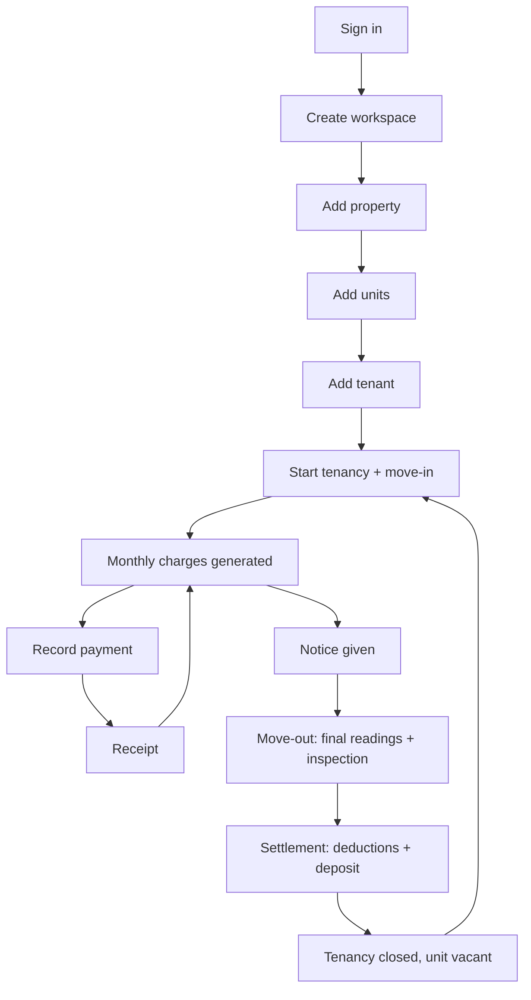

# 03 — User Flows & Business Logic

```text
Version:      0.1
Status:       Draft — awaiting owner review
Last Updated: 2026-09-18
Depends On:   01_PRD.md, 02_FEATURE_SPECIFICATION.md
Affected By:  10_FINANCIAL_RULES.md, 08_SYNC_SPECIFICATION.md, 16_DECISION_LOG.md
```

## Conventions

- Flow IDs `FL-nn` are referenced by the traceability matrix (17) and the tests (14).
- Screen IDs `SCR-nn` are defined in `09_UI_UX_SPECIFICATION.md`.
- "Saved locally" means the Android offline path. The website performs the same step through the API and shows the server's answer at once.
- Numbers use ₹ for examples. Every rule is currency-neutral.

## Main lifecycle



Reading the diagram: the loop G → H → I repeats every month. The lower path runs once per tenancy.

## Flow index

| ID | Flow | Main requirements |
|---|---|---|
| FL-01 | New landlord onboarding | ACC-001/002, TEAM-001 |
| FL-02 | Add property | PROP-001, OWN-001 |
| FL-03 | Add units | UNIT-001/002 |
| FL-04 | Add tenant | TENANT-001/005 |
| FL-05 | Start tenancy (new move-in) | TENANCY-001/003/004, MOVEIN-003, DEP-001, RENT-002/009 |
| FL-06 | Move-in inspection and opening readings | MOVEIN-001/002 |
| FL-07 | Add existing tenancy with opening balances | TENANCY-002 |
| FL-08 | Monthly rent generation (system) | RENT-001/009 |
| FL-09 | Record payment | PAY-001/002/005/006 |
| FL-10 | Partial payment | PAY-003, RENT-005 |
| FL-11 | Advance payment | PAY-002 |
| FL-12 | Overdue rent and reminders | RENT-005, PAY-009, NOTIF-001 |
| FL-13 | Rent increase | TENANCY-006 |
| FL-14 | Record electricity/utility reading | UTIL-002/003/005 |
| FL-15 | Readings round | UTIL-004 |
| FL-16 | Record expense | EXP-001/002 |
| FL-17 | Correct or void an entry | RENT-004, PAY-004 |
| FL-18 | Notice and move-out | MOVEOUT-001/002 |
| FL-19 | Security deposit settlement | MOVEOUT-003/004/005, DEP-004/005 |
| FL-20 | Unit becomes vacant | UNIT-003, REP-009 |
| FL-21 | New tenant replaces old tenant | TENANCY-003 |
| FL-22 | Tenant moves to another unit | TENANCY-010 (V1 guided), MVP manual |
| FL-23 | Archive or delete property | PROP-003/004 |
| FL-24 | Export records | REP-005/010 |
| FL-25 | Account and workspace deletion | ACC-005, TEAM-007 |
| FL-26 | Invite member and scoped access | TEAM-003/004/005 |
| FL-27 | Offline payment and sync | SYNC-001…006 |
| FL-28 | Refund advance credit | PAY-007 |

---

## FL-01 New landlord onboarding
Actor: new user · Screens: SCR-01, SCR-02, SCR-03, SCR-06, SCR-22, SCR-24, SCR-40/41

```text
START  User opens the app or website for the first time
↓
ACTION  "Continue with Google" or enter email → receive 6-digit code → enter code
↓
VALIDATION  Internet available; code valid (≤ 10 min old, ≤ 5 attempts)
↓
DECISION  Pending invite for this email?
   ├─ Yes → Accept invite (SCR-04) → membership ACTIVE → initial sync → Home of that workspace → END
   └─ No → Existing memberships?
        ├─ Yes → Home of last-used workspace → END
        └─ No → Create workspace: name, country, default currency, time zone
↓
VALIDATION  Name 2–80 chars; valid country/currency/time zone
↓
NEXT STATE  Workspace created; user = Owner; Home shows onboarding checklist (SCR-06)
↓
ACTION  1 Add property (FL-02) → 2 Add units (FL-03) → 3 Add tenancy
↓
DECISION  Is the tenant already living there?
   ├─ Yes → Existing tenancy wizard (FL-07)
   └─ No  → New tenancy wizard (FL-05)
↓
NEXT STATE  Dashboard shows the first dues ("₹15,000 due by 5 Oct")
↓
END
```

Edge cases:
- Offline at first launch → "You need internet to sign in." Nothing else is possible until sign-in.
- App closed mid-onboarding → the checklist shows completed steps; nothing is lost.
- Code email lands in spam → "Didn't get it? Check spam or resend (60 s)."
- User signs in with a different Google account than expected → they see an empty workspace list; the switcher shows the signed-in email.
- Device time zone differs from the property location → the time zone is editable on the create-workspace screen and in settings.
- Invited user with a large workspace → progress screen "Downloading 1,240 records…" during the initial sync.

## FL-02 Add property
Actor: Owner/Admin/Manager (all-properties) · Screens: SCR-20, SCR-22, SCR-23

```text
START  Properties → "+"
↓
ACTION  Name, type, address, country, currency (default: workspace), notes, photo;
        optional owners with shares; optional payment-instructions override
↓
VALIDATION  Name unique in workspace (case-insensitive); valid codes;
            if > 1 owner, shares total exactly 100.00%
↓
DECISION  Type = independent house?
   ├─ Yes → also create unit "Main"
   └─ No  → no units yet
↓
NEXT STATE  Property ACTIVE
↓
ACTION  Prompt: "Add units"
↓
END
```

Edge cases:
- Two devices create properties with the same name offline → the second is rejected (DUPLICATE_NAME) → sync issue "Rename property".
- Three owners at 33.33% → "Split equally" gives 33.34 / 33.33 / 33.33 so the total is exactly 100.00.
- Property currency differs from the workspace default → allowed; the dashboard shows a currency switch.
- Property in another time zone → the workspace time zone still applies (D-044); due dates may appear one day off in rare cases.

## FL-03 Add units
Actor: Manager+ · Screens: SCR-21, SCR-24, SCR-26

```text
START  Property detail → "Add units"
↓
DECISION  One unit or many?
   ├─ One  → label, type, floor/block, area, default rent, default deposit, notes
   └─ Many → count (1–200), pattern "Room {n}", start number, step, zero-pad digits,
             type, floor/block, default rent/deposit → preview list
↓
VALIDATION  Labels unique in the property (case-insensitive); pattern contains {n}
↓
DECISION  Collisions in the preview?
   ├─ Yes → colliding rows highlighted → user changes start or pattern
   └─ No  → save as one atomic operation
↓
NEXT STATE  Units exist, all Vacant
↓
END
```

Edge cases:
- More than 200 units → create in batches (e.g. per floor with the floor label set).
- Another device created "Room 104" offline → the bulk operation is rejected as a whole (all-or-nothing) → the user edits the colliding label and retries.
- Default rent left empty → the tenancy wizard asks for rent (rent must be > 0 on a tenancy).

## FL-04 Add tenant
Actor: Manager+ · Screens: SCR-30, SCR-32 (also inside SCR-40)

```text
START  Tenants → "+" (or "New tenant" inside the tenancy wizard)
↓
ACTION  Kind, full name, phone, alternate phone, email, permanent address,
        emergency contact, ID type + last 4 characters, notes; attach ID/photos
↓
VALIDATION  Name required; phone valid E.164; email valid; ID last 4 ≤ 4 chars
↓
DECISION  Phone or email matches an existing tenant?
   ├─ Yes → "Possible duplicate: Rahul Verma (Room 101, 2024)" → [Use existing] / [Create anyway]
   └─ No  → save
↓
NEXT STATE  Tenant exists (listed under All until a tenancy starts)
↓
END
```

Edge cases:
- No phone and no email → allowed with warning "Reminders won't be available."
- Company tenant → kind = company; contact person added as co-tenant or in notes.
- ID photos captured offline → uploaded later; they are marked sensitive automatically.
- User types a full Aadhaar/ID number into the "last 4" field → the field accepts only 4 characters; notes show a hint "Don't store full ID numbers."

## FL-05 Start tenancy (new move-in)
Actor: Manager+ · Screens: SCR-40, SCR-55, SCR-62, SCR-43

```text
START  Unit detail "Start tenancy" / Home "+" → New tenancy
↓
ACTION  Step 1: unit, primary tenant (pick/create), co-tenants/occupants
↓
VALIDATION  Unit not archived; exactly one primary tenant
↓
ACTION  Step 2: move-in date, lease end, rent, cycle day (default 1 or "same as move-in day" ≤ 28),
        grace days (default 4), notice period, recurring monthly charges
↓
VALIDATION  Rent > 0; cycle day 1–28; grace 0–60; lease end > move-in;
            local overlap check against the unit's known tenancies
↓
DECISION  Overlap with another tenancy (incl. upcoming or on-notice)?
   ├─ Yes → UNIT_OCCUPIED with the other tenancy's dates → change date or unit
   └─ No  → continue
↓
ACTION  Step 3: deposit agreed, one-time move-in charges
ACTION  Step 4: opening meter readings (FL-06)
ACTION  Step 5: move-in inspection (FL-06, can be skipped)
ACTION  Step 6: documents (agreement, IDs)
ACTION  Step 7: review proposed charges (prorated first period, backdated periods,
        recurring charges, deposit, one-time) → edit amounts if needed
↓
VALIDATION  Amounts ≥ 0
↓
ACTION  Confirm → one atomic operation `tenancy.start` (saved locally or sent)
↓
DECISION  Server accepts? (exclusion constraint, validations)
   ├─ No  → web: error shown; Android: sync issue "Unit occupied 1–30 Sep by Rahul" → edit
   └─ Yes → Tenancy ACTIVE; unit Occupied (or Upcoming if the date is in the future)
↓
DECISION  Collect money now?
   ├─ Yes → Record payment (FL-09) prefilled with deposit + amount due
   └─ No  → Tenancy detail
↓
END
```

Edge cases:
- Future move-in date → the unit shows Upcoming; the deposit charge exists now (due on the move-in date); rent charges start on the move-in date.
- Backdated move-in (3 months ago) → the review lists every period to date; the user can remove lines (e.g. paid outside the app → record payments or remove charges).
- Move-in on the 31st with "same as move-in day" → cycle day 28 is used; the review shows the short first period prorated.
- Tenant already rents another unit → allowed (another tenancy).
- Unit has no meters → steps 4 is skipped with a hint to add meters.
- Rent-free first month → keep the rent line and add a waiver credit (keeps history clear), or set the line to 0.
- Wizard interrupted → Android keeps the draft until finished or discarded; the website warns before leaving the page.
- Unit is on notice (old tenant leaves 30 Sep) → new tenancy from 1 Oct is allowed (FL-21).

## FL-06 Move-in inspection and opening readings
Actor: Manager+ · Screens: SCR-40 (steps 4–5), SCR-55, SCR-62

```text
START  Tenancy wizard steps 4–5, or Tenancy detail → Inspections → "Move-in inspection"
↓
ACTION  For each meter on the unit: enter reading + photo (date = move-in date)
↓
VALIDATION  Value ≥ the meter's last reading (unless meter replacement)
↓
DECISION  Meter inaccessible?
   ├─ Yes → skip with reason → tenancy flagged "No opening reading"
   └─ No  → reading saved as MOVE_IN
↓
ACTION  Inspection: template items for the unit type (editable); condition per item;
        notes; photos; keys handed over
↓
DECISION  Finish now?
   ├─ Yes   → completed
   └─ Later → saved incomplete; tenancy shows "Move-in inspection incomplete"
↓
END
```

Edge cases:
- 60 photos taken offline → stored on the device and uploaded later; the inspection is saved immediately.
- Meter replaced at move-in → enter old meter's final value and the new meter's start value.
- Skipped opening reading → the first regular reading becomes the baseline; no charge is proposed for it.

## FL-07 Add existing tenancy with opening balances
Actor: Manager+ · Screens: SCR-41

```text
START  Onboarding step 3 or Unit → "Add existing tenancy"
↓
ACTION  Unit, tenants, original start date, current rent, cycle day, grace, lease end,
        notice period, recurring charges
↓
ACTION  Billing start date: this period's start or next period's start
↓
VALIDATION  Billing start is a cycle start ≥ original start; no overlap using original start
↓
ACTION  Opening balance as of billing start: tenant owes ₹X / tenant paid ahead ₹Y / none
ACTION  Deposit: agreed amount and amount already held
↓
VALIDATION  Held ≤ agreed; owes XOR paid ahead
↓
ACTION  Baseline readings (last known value + date) per meter; documents
↓
ACTION  Review: opening entries + charges from billing start to today → confirm (atomic)
↓
NEXT STATE  Tenancy ACTIVE; ledger starts with "Opening balance" lines
↓
END
```

Edge cases:
- This month is already paid → choose next month as billing start so it is not charged twice.
- Landlord doesn't know exact arrears → enter the best estimate; correct later with a charge or credit.
- Deposit partly collected → held < agreed shows "Deposit due ₹x".
- Previous tenancy of this unit recorded with overlapping dates → rejected; fix the previous move-out date first.
- 40 existing tenants → repeat the wizard (CSV import in V1).

## FL-08 Monthly rent generation (system)
Actor: System job (hourly) · Screens: none

```text
START  Hourly job (also triggered right after a tenancy starts)
↓
ACTION  For each workspace: today = current date in the workspace time zone
↓
ACTION  For each ACTIVE tenancy: list period starts from billing start
        to min(today, move-out date or planned move-out date)
↓
VALIDATION  Does a charge with key "rent:<tenancy>:<period start>" exist (any status)?
↓
DECISION
   ├─ Exists  → skip
   └─ Missing → amount = rent revision effective at period start;
                also recurring charges effective in that period
                → insert in one transaction per tenancy
↓
NEXT STATE  New charges carry a new workspace version → devices receive them on next pull
↓
END
```

Edge cases:
- Job did not run for 2 days → the next run creates all missing periods.
- Two runs overlap → the unique key makes the second insert a no-op.
- User voided a generated charge (free month) → not re-created.
- Rent revision effective this period → the new amount is used.
- Tenancy cancelled or ended → skipped (ended: only periods up to move-out).
- Workspace time zone changed → next run uses the new zone.
- Phone offline on the 1st → it shows the previous state until it syncs (D-023).

## FL-09 Record payment
Actor: Manager+ · Screens: SCR-10, SCR-42, SCR-43, SCR-52

```text
START  Home row "Record payment" / Tenancy detail / "+" button
↓
ACTION  Sheet prefilled: amount = rent due now; deposit due (if any); date = today;
        method = last used
↓
ACTION  User adjusts amounts, method, reference; attaches proof (optional)
↓
VALIDATION  Amount > 0; date ≤ today + 1 and ≥ tenancy start − 365 days;
            tenancy not CLOSED/CANCELLED
↓
DECISION  Possible duplicate (same tenancy, amount, date; recorded < 24 h ago)?
   ├─ Yes → "Looks like ₹15,000 recorded at 10:42 by Priya" → [Record anyway] / [Cancel]
   └─ No  → continue
↓
ACTION  Save → payment entries (one per account) + allocation shown
        ("Clears Aug ₹10,000 and ₹5,000 of Sep")
↓
DECISION  Online?
   ├─ Yes → server accepts → receipt R-000123 → "Share receipt" enabled
   └─ No  → pending; "Receipt available after sync"
↓
NEXT STATE  Balance and charge statuses recomputed (FIFO)
↓
END
```

Edge cases:
- More than due → advance credit (FL-11).
- Deposit and rent in one handover → two entries, two receipts.
- Cheque received → record it; if it bounces, void with "Cheque bounced" (FL-17) and optionally add a bounce fee charge.
- Someone else paid for the tenant → note field.
- One bank transfer covers two tenancies → record one payment per tenancy (V1 split helper).
- Wrong tenancy selected → void and re-enter.
- Tenancy CLOSED on the server while the phone was offline → rejected (TENANCY_CLOSED) → sync issue with "Reopen settlement" or "Discard".
- Same cash recorded on the phone and the website → both kept; the later one is flagged "Possible duplicate" for a human to void.
- Phone clock set to the future → the server re-validates with its own date and rejects dates > today + 1.

## FL-10 Partial payment
Actor: Manager+ · Screens: SCR-43, SCR-42

```text
START  September rent ₹15,000 (due 5 Sep); tenant pays ₹10,000 on 3 Sep
↓
ACTION  Record payment ₹10,000
↓
VALIDATION  As FL-09
↓
NEXT STATE  FIFO: September paid ₹10,000, remaining ₹5,000 → "Partly paid · ₹5,000 left"
↓
DECISION  Due date passed with remaining > 0?
   ├─ Yes → Overdue chip; listed in "Needs attention"
   └─ No  → listed in "Due soon"
↓
ACTION  20 Sep: tenant pays ₹5,000 → FIFO → September Paid; balance ₹0
↓
END
```

Edge cases:
- Older arrears exist → the payment clears the oldest charge first, and the sheet says so before saving. The landlord cannot direct a payment to a newer month (D-021); the note field can record the tenant's intention.
- Two partial payments of the same amount on the same day → duplicate warning; the user confirms both.

## FL-11 Advance payment
Actor: Manager+ · Screens: SCR-43, SCR-42

```text
START  Only the September charge (₹15,000) exists; tenant pays ₹45,000 on 3 Sep
↓
ACTION  Record payment ₹45,000
↓
NEXT STATE  September Paid; balance −₹30,000 → "Advance ₹30,000"
↓
ACTION  1 Oct: job creates October charge → FIFO → October Paid; advance ₹15,000
↓
ACTION  1 Nov: November charge → Paid; advance ₹0
↓
END
```

Edge cases:
- Rent rises to ₹16,500 from November → the advance covers ₹15,000; ₹1,500 is due.
- Tenant leaves with advance remaining → refund (FL-28) or included in settlement (FL-19).
- Payment recorded offline on the 1st before the month's charge reached the phone → shows as advance until sync, then applies to the new charge.
- "Two months' rent in advance" required by the agreement as security → record as deposit, not as a payment (the wizard asks).

## FL-12 Overdue rent and reminders
Actor: System + Manager+ · Screens: SCR-10, SCR-54

```text
START  Day after a charge's due date with remaining > 0
↓
NEXT STATE  Charge flagged Overdue (derived); tenancy listed in "Needs attention",
            oldest overdue first
↓
ACTION  Daily digest at 09:00 (workspace time): "2 newly overdue (₹25,000)"
↓
ACTION  Landlord taps "Remind" → message with amount, oldest due month, payment details
        → WhatsApp / SMS / share sheet
↓
VALIDATION  Tenant has a phone (WhatsApp/SMS) or email
↓
DECISION  Tenant pays?
   ├─ Yes → FL-09
   └─ No  → more reminders; manual late fee charge (MVP); settlement or write-off later
↓
END
```

Edge cases:
- No phone → email or share sheet only.
- Several months overdue → message shows the total and the oldest month.
- Reminder sent twice → activity list on the tenancy shows each "Reminder noted".
- Landlord wants a late fee → manual LATE_FEE charge (automatic in V1).

## FL-13 Rent increase
Actor: Manager+ · Screens: SCR-48

```text
START  Tenancy → "Change rent"
↓
ACTION  New rent, effective from (period starts only), reason
↓
VALIDATION  Rent > 0; effective date is a period start ≥ billing start; no revision on that date
↓
DECISION  Effective date ≤ latest charged period start?
   ├─ Yes → propose one adjustment per charged period
   │        ("Rent adjustment · Oct 2026 +₹1,500", or credits for a decrease) → confirm/edit
   └─ No  → only future periods change
↓
NEXT STATE  Rent revision (+ adjustments) saved atomically; schedule preview updated
↓
DECISION  Increase the deposit too?
   ├─ Yes → deposit increase (F-DEP-2)
   └─ No  → END
↓
END
```

Edge cases:
- Mid-period change requested → not supported; choose the next period start.
- Two offline revisions for the same date → the second is rejected (REVISION_EXISTS).
- Effective date after the planned move-out → warning; it has no effect.

## FL-14 Record electricity/utility reading
Actor: Manager+ · Screens: SCR-60, SCR-62

```text
START  Unit/meter → "Record reading" (or "+" → Reading)
↓
ACTION  Pick meter; see previous value, date and photo; enter new value + photo
↓
VALIDATION  Date ≥ previous reading date; one reading per meter/date/type
↓
DECISION  New value < previous value?
   ├─ Yes → "Meter replaced or reset?" → old meter's final value + new meter's start value
   └─ No  → continue
↓
DECISION  Unit has an ACTIVE tenancy with a baseline reading inside that tenancy?
   ├─ Yes → proposed charge = consumption × rate + fixed (10 §11) → confirm or edit
   └─ No  → reading saved only (baseline or vacant unit)
↓
NEXT STATE  Reading + charge saved atomically; balance updated
↓
END
```

Edge cases:
- Rate changed since the last bill → the current rate is used and stored on the charge.
- Previous reading belongs to the previous tenant → billing starts from this tenancy's MOVE_IN reading.
- Consumption 0 → only the fixed fee is proposed (no charge if the fixed fee is 0).
- Consumption more than 5× the average of the last 3 bills → "Unusually high — check the reading" confirmation.
- Bill amount known instead of readings → add a manual UTILITY charge (F-RENT-2).
- Reading with decimals → up to 3 decimals.

## FL-15 Readings round
Actor: Manager+ · Screens: SCR-63

```text
START  Property → Meters → "Readings round"
↓
ACTION  Rows sorted by floor/label with previous values; enter each new value; photo per row
↓
VALIDATION  Per row as FL-14; invalid rows highlighted
↓
DECISION  All rows valid or skipped?
   ├─ No  → "3 rows need attention"
   └─ Yes → review: readings count, charges per tenancy, total amount
↓
ACTION  Save → one atomic operation per meter
↓
NEXT STATE  "18 readings saved · 15 charges created (₹31,240)"
↓
END
```

Edge cases:
- App closed mid-round → the draft is kept on the device.
- Some rows rejected by the server → the others still succeed; failures appear in sync issues.
- Vacant units and common meters → readings only, no charges (MVP).

## FL-16 Record expense
Actor: Manager+ · Screens: SCR-70, SCR-72

```text
START  Money → Expenses → "+" (or Property detail → Expenses)
↓
ACTION  Property (optional), unit, category, amount, date, payee, method, reference, note, receipt photo
↓
VALIDATION  Amount > 0; date ≤ today + 1
↓
NEXT STATE  Expense saved; property month summary (net cash) updated
↓
END
```

Edge cases:
- Workspace-level expense (accountant fee) → no property; counted in workspace totals only.
- Paid in another currency → convert outside the app; the expense uses the property currency.
- Same expense edited on two devices → field-level last-write-wins; audit keeps both versions.

## FL-17 Correct or void an entry
Actor: Manager+ · Screens: SCR-42, SCR-47

```text
START  Ledger line → "Void" or "Correct"
↓
ACTION  Reason: entered in error / duplicate / cheque bounced / amount wrong / other (text)
↓
VALIDATION  Entry ACTIVE; not part of a finalized settlement; tenancy not CLOSED;
            voiding a deposit payment must not make deposit held negative
↓
DECISION  "Correct" chosen?
   ├─ Yes → void + prefilled new entry → save
   └─ No  → void only
↓
NEXT STATE  FIFO recomputed; receipt shows VOID; audit event recorded
↓
END
```

Edge cases:
- The entry was never synced → the pending create is removed; nothing reaches the server.
- Voided on two devices → second void is a no-op success.
- Voiding a generated rent charge → warning "This period won't be billed again automatically."
- Voiding a charge that payments were covering → those payments move to the next charge or become advance.
- Entry belongs to a settlement → "Reopen the settlement to change it."

## FL-18 Notice and move-out
Actor: Manager+ · Screens: SCR-49, SCR-50, SCR-55, SCR-62

```text
START  Tenant gives notice → Tenancy → "Give notice"
↓
ACTION  Notice date, planned move-out date (last day of occupancy), given by (tenant/landlord)
↓
VALIDATION  Planned ≥ notice date; warning if shorter than the agreed notice period
↓
NEXT STATE  Tenancy on notice; unit "On notice"; a new tenancy may start from planned date + 1
↓
ACTION  (digest reminders 7 days and 1 day before)
↓
ACTION  Move-out day → "Move out": actual date, final readings with photos,
        move-out inspection (move-in conditions shown alongside), keys returned
↓
VALIDATION  Date ≥ move-in; readings ≥ previous
↓
DECISION  Actual date later than planned and overlapping an upcoming tenancy?
   ├─ Yes → UNIT_OCCUPIED → move the upcoming tenancy's start first
   └─ No  → continue
↓
NEXT STATE  Tenancy ENDED; settlement DRAFT created → FL-19
↓
END
```

Edge cases:
- Tenant absconds → move-out with estimated date, photos, notes; readings if accessible.
- Notice withdrawn → clear the planned date.
- Landlord-initiated termination → "given by landlord".
- Move-out recorded days later → backdated date allowed.
- Only one co-tenant leaves → remove that party (F-TNCY-3); the tenancy continues.

## FL-19 Security deposit settlement
Actor: Manager+ (reopen: Owner/Admin) · Screens: SCR-51, SCR-53

```text
START  Settlement DRAFT after move-out
↓
ACTION  App proposes:
        a) void generated charges for periods starting after the move-out date
        b) proration credit for the final period (10 §5.3)
        c) final utility charges from MOVE_OUT readings
        d) deductions entered by the user (damage, cleaning, other + photos)
↓
ACTION  Shows: rent balance after a–d; deposit held; deposit applied = min(held, positive balance);
        refund due = held − applied + advance credit; or amount owed = balance − applied
↓
DECISION  User edits lines? → recompute
↓
DECISION  Refund paid now?
   ├─ Yes → method, date, reference → refund entries included
   └─ No  → refund due stays as deposit held
↓
ACTION  Finalize → atomic `settlement.finalize` with the expected totals
↓
VALIDATION (server)  Tenancy ENDED; no other open settlement; recomputed totals = expected
↓
DECISION
   ├─ Totals differ → SETTLEMENT_STALE → new preview shown → user reconfirms
   └─ Equal → entries created; settlement FINALIZED; PDF available
↓
DECISION  Rent balance = 0 and deposit held = 0?
   ├─ Yes → Tenancy CLOSED
   └─ No  → ENDED with "Refund due ₹x" or "Tenant owes ₹x"
↓
END
```

Worked numbers are in `10_FINANCIAL_RULES.md` §10.

Edge cases:
- Deductions exceed the deposit → tenant owes the difference; later payment or write-off closes the tenancy.
- Tenant has an advance → refund = deposit remainder + advance.
- Refund paid later → recording it closes the tenancy automatically.
- Dispute after finalizing → Owner/Admin reopen (entries voided; refunds that were really paid can be kept).
- A payment from an offline phone arrives after finalizing → tenancy ENDED: accepted (reduces amount owed); tenancy CLOSED: rejected (TENANCY_CLOSED) → reopen or discard.
- Final reading missing → skip the utility line or add a bill amount manually.

## FL-20 Unit becomes vacant
Actor: System · Screens: SCR-21, SCR-25, SCR-81

```text
START  Tenancy moved out on date D
↓
NEXT STATE  From D + 1 the unit is Vacant (unless another tenancy starts on D + 1)
↓
ACTION  Vacancy report counts days vacant; dashboard occupancy updates
↓
DECISION  New tenant ready?
   ├─ Yes → FL-05 / FL-21
   └─ No  → stays Vacant; repainting etc. recorded as unit expenses
↓
END
```

Edge cases:
- Settlement still pending → unit is Vacant anyway (settlement is independent of occupancy).
- Meter readings during vacancy → saved without charges; the landlord's own utility cost is an expense.

## FL-21 New tenant replaces old tenant
Actor: Manager+ · Screens: SCR-40, SCR-50

```text
START  Old tenancy on notice (planned move-out D)
↓
ACTION  Start new tenancy on the same unit with move-in ≥ D + 1 (FL-05)
↓
VALIDATION  No overlap (old occupancy = start … D)
↓
NEXT STATE  Unit shows "On notice" + "Upcoming 1 Oct"
↓
ACTION  Old tenant moves out (FL-18) and settles (FL-19);
        the app offers "Use this reading as the new tenancy's opening reading"
↓
ACTION  New tenancy starts on its date
↓
END
```

Edge cases:
- Old tenant stays longer → blocked until the new tenancy's start moves.
- Same-day turnover → move-out date = last day of occupancy (e.g. 30 Sep), new move-in 1 Oct; one physical reading can be recorded as MOVE_OUT (old) and MOVE_IN (new) with the same value.

## FL-22 Tenant moves to another unit
Actor: Manager+ · Screens: SCR-50, SCR-51, SCR-40

MVP manual procedure (guided flow in V1, TENANCY-010):

```text
START  Tenant moves from Unit A to Unit B
↓
ACTION  Unit A: notice / move-out on D → settlement
↓
DECISION  Transfer the deposit instead of refunding it?
   ├─ Yes → settlement refund line with method INTERNAL_TRANSFER ("to Unit B")
   │        → start tenancy on Unit B (move-in D + 1) with a deposit payment of the same amount,
   │          method INTERNAL_TRANSFER
   └─ No  → normal refund; new deposit collected on B
↓
ACTION  Arrears on A stay on A until paid; advance on A is refunded or transferred the same way
↓
NEXT STATE  A CLOSED (or ENDED with balance), B ACTIVE; tenant history shows both
↓
END
```

Edge cases:
- Different deposit on B → top-up charge for the difference.
- Internal transfers are excluded from collections and cash reports (10 §13) so income is not double-counted.

## FL-23 Archive or delete property
Actor: Owner/Admin · Screens: SCR-21

```text
START  Property → ⋮ → Archive / Delete
↓
DECISION  Delete?
   ├─ Yes → VALIDATION no tenancies, entries, meters, readings, expenses, documents
   │        → if any exist: offer Archive instead
   └─ No (Archive) → VALIDATION no ACTIVE tenancies (incl. upcoming)
↓
DECISION  Passes?
   ├─ No  → list blockers ("3 active tenancies: Room 101, 102, 104")
   └─ Yes → confirm
↓
NEXT STATE  Archived (units archived; excluded from dashboards and billing) or deleted
↓
END
```

Edge cases:
- Property sold with tenants staying → end tenancies with settlement notes "Transferred to new owner"; export statements for the buyer.
- ENDED tenancies with pending settlement → archive allowed; settlement still possible from the archived property.
- Archived offline while a tenancy was started on the web → archive rejected on sync.

## FL-24 Export records
Actor: per role · Screens: SCR-80, SCR-81, SCR-53, SCR-82

```text
START  Reports → Export / Settings → Data export
↓
DECISION  Which export?
   ├─ Report CSV → current filters → download/share
   ├─ Tenant statement → PDF or CSV → share (FL via SCR-53)
   └─ Full export (Owner/Admin, website) → include archived? → streaming ZIP
↓
VALIDATION  Permission; online
↓
NEXT STATE  File downloaded; audit event "export"
↓
END
```

Edge cases:
- Very large workspace → streamed; may take minutes (limit noted in 19).
- Names in non-Latin scripts → CSV is UTF-8 with BOM so Excel shows them correctly.
- Scoped user → export contains only their properties.
- Workspace in deletion grace → Owner can still export.

## FL-25 Account and workspace deletion
Actor: any user (workspace: Owner) · Screens: SCR-97

```text
START  Settings → Delete account / Delete workspace
↓
DECISION  Delete workspace?
   ├─ Yes (Owner) → offer export → type workspace name → scheduled for 30 days;
   │                members lose access immediately and are emailed
   └─ No (account) → check blockers
↓
VALIDATION  Owner of a workspace with other active members? → transfer ownership or delete it first
VALIDATION  Android has unsynced changes? → sync or discard first
↓
ACTION  Type DELETE → confirm
↓
NEXT STATE  Account pending deletion (30 days); signed out everywhere; confirmation email
↓
DECISION  Signs in during grace?
   ├─ Yes → "Cancel deletion?" → restored
   └─ No  → day 30: purge solo workspaces (data + files), profile, memberships elsewhere;
            audit entries show "Former member"
↓
END
```

Edge cases:
- Member (not owner) elsewhere → only the membership is removed there.
- Android offline during deletion → next sync gets 401/403 → local data wiped.
- Backups still contain data until they expire (≤ 7 days provider, ≤ 28 days off-site); stated in the privacy policy.

## FL-26 Invite member and scoped access
Actor: Owner/Admin → invitee · Screens: SCR-93, SCR-94, SCR-04

```text
START  Settings → Team → Invite
↓
ACTION  Email, role (Admin/Manager/Viewer), access (all / selected properties)
↓
VALIDATION  Valid email; not already a member; ≥ 1 property if scoped
↓
NEXT STATE  Membership INVITED; email with link (valid 7 days)
↓
ACTION  Invitee opens link → signs in
↓
VALIDATION  Signed-in email = invited email; invite not expired or revoked
↓
DECISION
   ├─ Email mismatch → "This invite is for a@b.com. Sign in with that email."
   ├─ Expired        → "Ask for a new invite."
   └─ OK             → membership ACTIVE → scoped initial sync
↓
ACTION  Later: Owner changes role/scope → member's next sync detects the change
        → full resync (or local wipe if revoked)
↓
END
```

Edge cases:
- Invitee already has their own workspace → now belongs to two.
- Scoped manager creates a tenant → visible to them even before a tenancy links it to their property.
- Scope reduced while the member has pending changes on the removed property → those are rejected (FORBIDDEN) and listed in sync issues.
- Viewer attempts an edit via an old app version → server rejects.

## FL-27 Offline payment and sync
Actor: Android app + server + website · Detailed protocol: `08_SYNC_SPECIFICATION.md`

```text
PHONE OFFLINE
↓
Landlord records ₹15,000 cash payment for Room 101
↓
Saved locally: ledger entry (pending) + outbox operation; balance updates on the phone
↓
Internet returns (WorkManager network condition met)
↓
Push: op "ledger.payment" {op_id, entity id, data}
↓
Server validates: identity, role, property scope, tenancy state, amount, date
↓
Server accepts: inserts entry, assigns receipt R-000123, version 18431, audit event
↓
Server returns the canonical record
↓
Phone replaces its local copy (receipt number, version); removes the op from the outbox
↓
Pull: phone downloads other changes since its cursor
↓
Website shows the payment on its next load
↓
END
```

Variants:
- **Website recorded another ₹15,000 for the same tenancy during the offline period** → both are kept (different entry IDs); the later one is flagged "Possible duplicate" on both clients; a person voids one if it was the same real payment.
- **Tenant's phone edited on the phone, email edited on the website** → both fields survive (field-level merge).
- **Both edited the phone number** → the change that reaches the server last wins; the other value is in the audit log.
- **Response lost after the server applied the op** → the retry has the same op_id → server returns the stored result → no duplicate.
- **Tenancy closed on the website meanwhile** → REJECTED (TENANCY_CLOSED) → sync issue with actions.

## FL-28 Refund advance credit
Actor: Manager+ · Screens: SCR-46

```text
START  Tenancy balance −₹5,000 (advance) → "Refund"
↓
ACTION  Amount (prefilled 5,000), date, method, reference
↓
VALIDATION  Amount ≤ advance credit (server re-checks at acceptance)
↓
NEXT STATE  REFUND entry; balance ₹0
↓
END
```

Edge cases:
- Partial refund → the remaining advance keeps applying to future charges.
- A new charge consumed the advance before the offline refund synced → server rejects (REFUND_EXCEEDS_CREDIT) → sync issue.
- Refund at move-out → handled inside settlement (FL-19).
