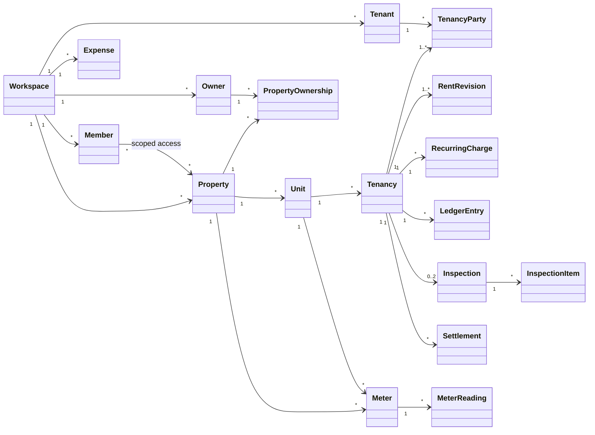
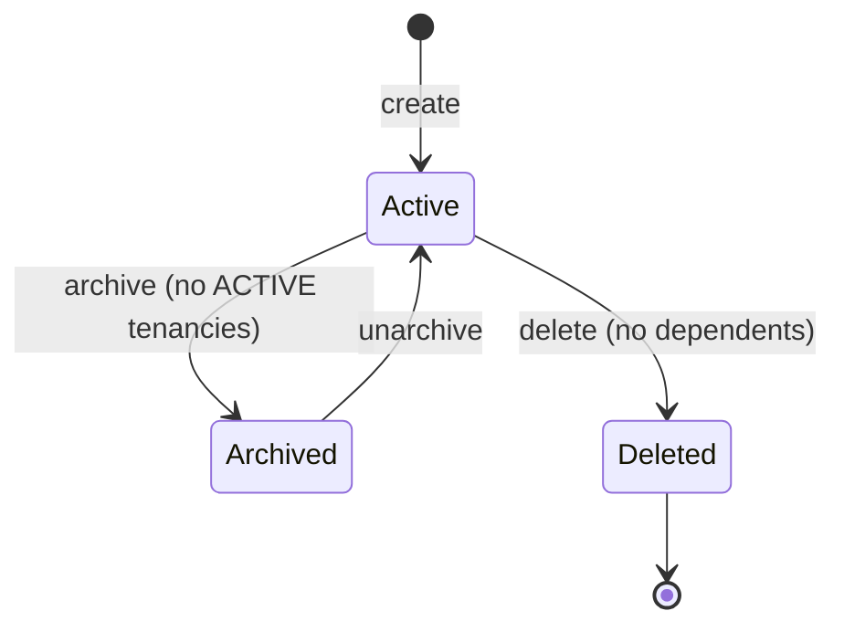
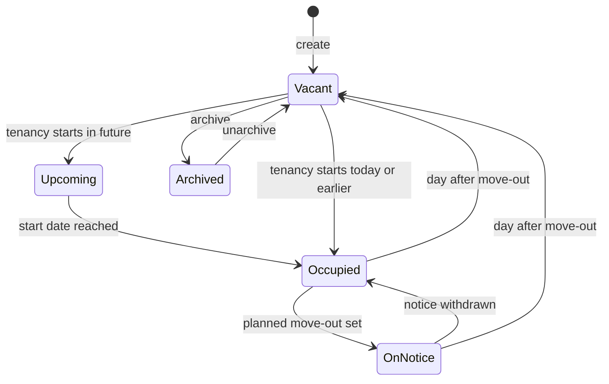
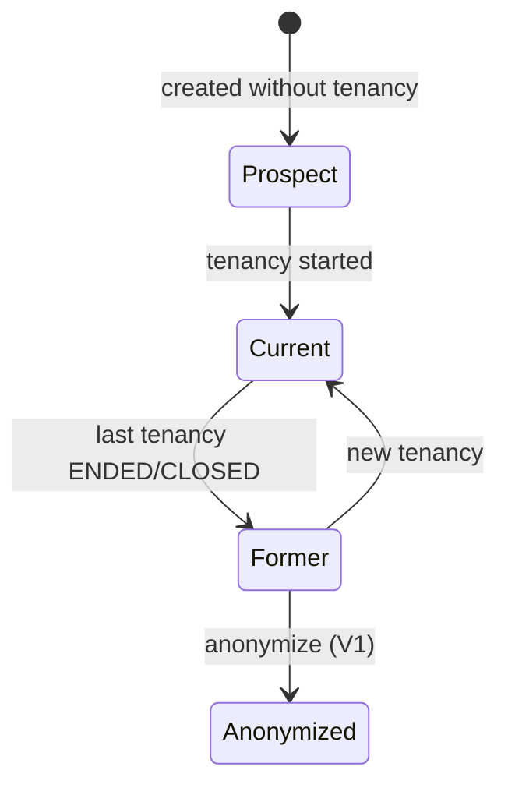
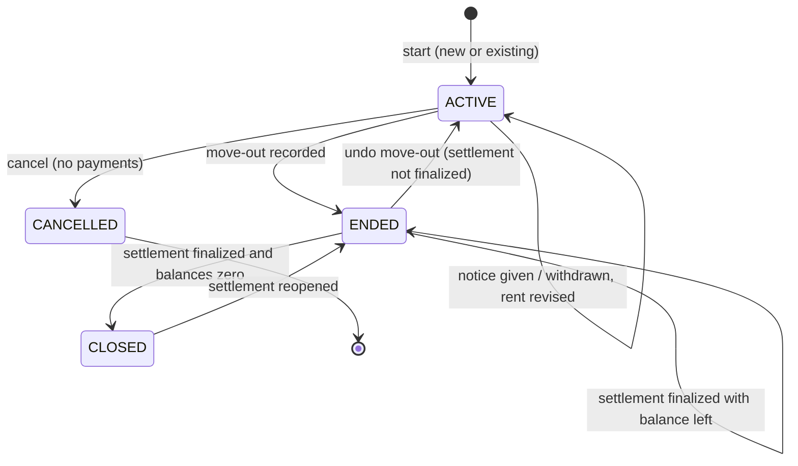
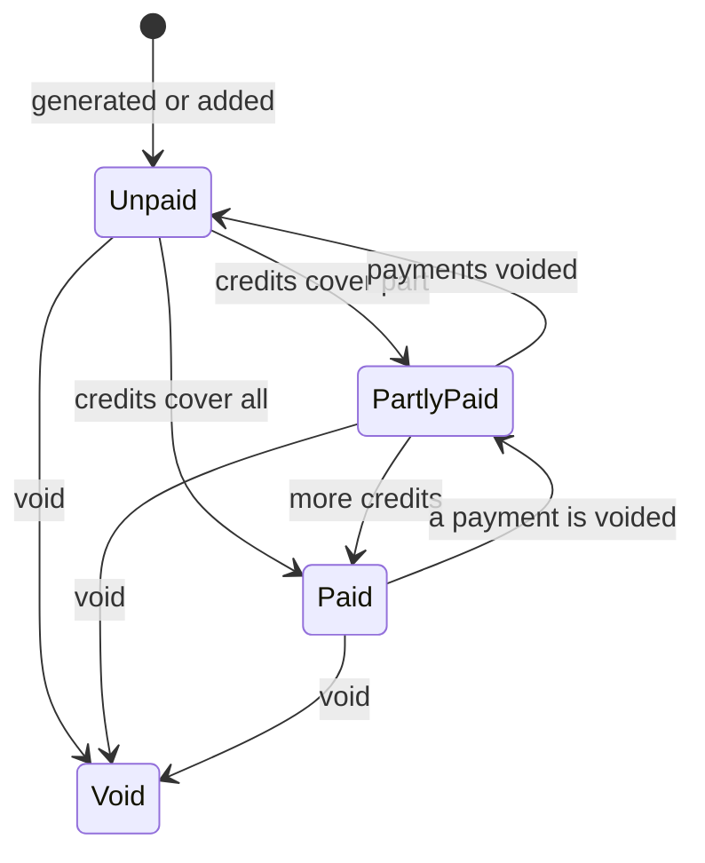
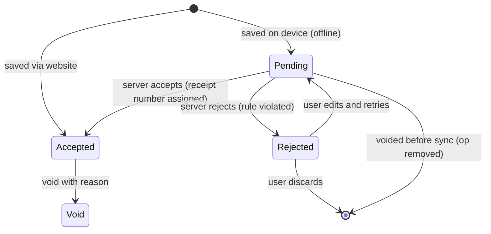
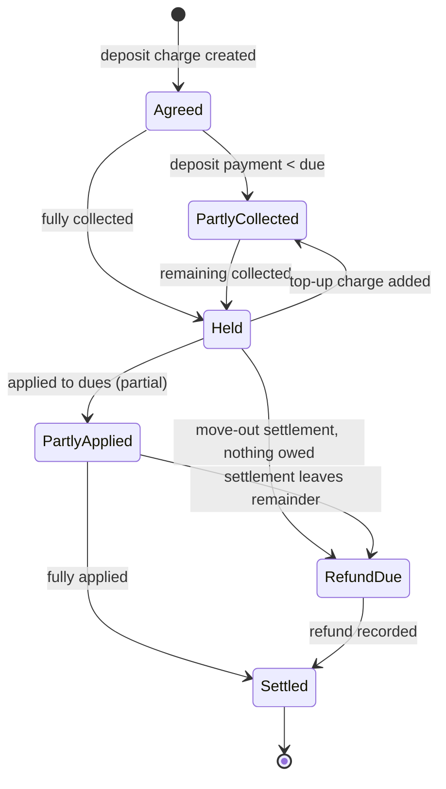
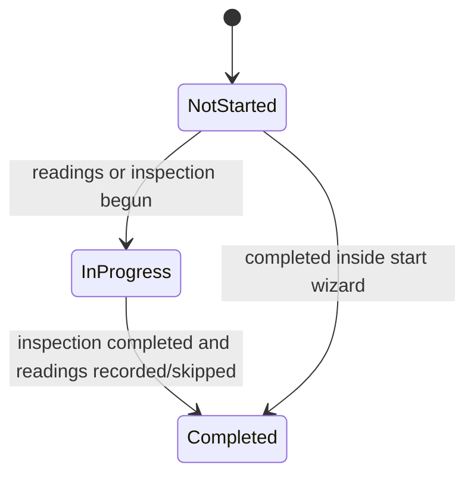
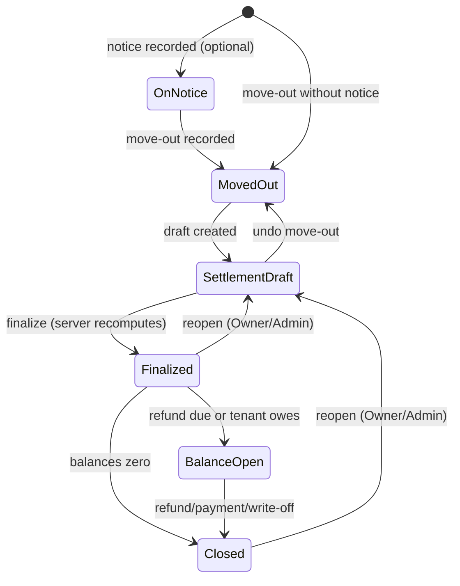

# 04 — Domain Model

```text
Version:      0.1
Status:       Draft — awaiting owner review
Last Updated: 2026-09-18
Depends On:   01_PRD.md, 02_FEATURE_SPECIFICATION.md, 03_USER_FLOWS.md
Affected By:  10_FINANCIAL_RULES.md, 16_DECISION_LOG.md
```

This document defines the real-world concepts and how they relate, before any table exists. `05_DATABASE_DESIGN.md` must implement exactly this model. If the two disagree, this document wins and 05 is corrected.

## 1. Mapping the prompt's concepts to the model

| Concept in the brief | Domain entity | Note |
|---|---|---|
| Landlord | **Workspace** (the business account) + **Member** (a person with a role) + **Owner** (legal owner record) | A landlord is usually the workspace Owner. A property manager's workspace holds properties of several Owners. |
| Property | **Property** | A building, house, or site. |
| Unit | **Unit** | Whatever is rented for one rent: flat, room, bed, shop… |
| Tenant | **Tenant** | A person or company, reusable across tenancies. |
| Tenancy | **Tenancy** + **Tenancy party** | The agreement; parties = primary tenant, co-tenants, occupants. |
| Rent | **Rent revision** (the agreed amount over time) + rent **Charges** (what is billed per period) | Rent is not a "paid/unpaid" flag; it is a series of charges. |
| Payment | **Ledger entry** of kind PAYMENT | Append-only. |
| Security deposit | The tenancy's **deposit account** (entries on the ledger) | Held money is derived, not stored. |
| Meter / Meter reading | **Meter**, **Meter reading** | |
| Utility bill | **Charge** of category UTILITY linked to readings | Or a manual bill amount. |
| Expense | **Expense** | Landlord's costs; not on tenant ledgers. |
| Maintenance | Future; repairs are Expenses in MVP | D-042 |
| Document | **Document** | Attached to any entity. |
| Move-in / Move-out inspection | **Inspection** (kind MOVE_IN / MOVE_OUT) + **Inspection item** | |
| (new) Settlement | **Settlement** | The move-out money close-out. |

## 2. Glossary

| Term | Meaning |
|---|---|
| Workspace | One business account and the data-isolation boundary. Has members, settings, time zone, counters. |
| Member | A user's membership in a workspace, with a role and property scope. |
| Owner (record) | A legal owner of one or more properties, with ownership share. May or may not be a member. |
| Workspace Owner (role) | The single member with full control of the workspace. Not the same as an Owner record. |
| Period | One monthly rent cycle: from a cycle start date to the day before the next cycle start. |
| Cycle day | Day of month (1–28) on which each period starts. |
| Grace days | Days after period start by which rent must be paid. Due date = period start + grace days. |
| Billing start date | First date from which the system bills a tenancy. Equals the move-in date for new tenancies; later for digitized ones. |
| Ledger | The append-only list of money entries of one tenancy. |
| Account | A sub-ledger: RENT (rent and all other charges) or DEPOSIT (security deposit). |
| Charge | Money the tenant owes (debit). |
| Payment | Money received from the tenant (credit). |
| Credit | Reduction of what is owed without money (discount, waiver, adjustment, write-off, proration). |
| Refund | Money paid back to the tenant. |
| Deposit applied | Moving held deposit money to pay the tenant's rent-account dues. |
| Rent balance | What the tenant owes on the RENT account now. Negative = advance credit. |
| Deposit held | Deposit money the landlord currently holds for the tenant. |
| FIFO allocation | The deterministic rule that credits settle the oldest-due charges first. |
| Void | Cancelling an entry: it stays visible but counts for nothing. |
| Settlement | The move-out calculation that applies the deposit and determines refund or amount owed. |
| Version | Server-assigned, per-workspace increasing number stamped on every change (for sync). |

## 3. Relationship overview



Reading the diagram: the **Tenancy** is the centre of the money model. A unit has many tenancies over time (never overlapping). A tenant takes part in many tenancies through TenancyParty. Documents (not drawn) attach to any entity.

## 4. Entities

Attributes below are the domain attributes. Technical columns (ids, versions, timestamps, audit fields) are added in 05.

### 4.1 Workspace
| Aspect | Definition |
|---|---|
| Purpose | Business account and isolation boundary for all data (BR-001). |
| Attributes | name, country, default currency, time zone, rounding setting, receipt prefix/footer, landlord display details, payment instructions, default digest time, storage quota, plan (V1). |
| Lifecycle | ACTIVE → PENDING_DELETION (30 days) → PURGED; PENDING_DELETION → ACTIVE (cancel). |
| Relationships | Has members, owners, properties, tenants, expenses; everything else transitively. |
| Ownership | Root. Controlled by its single Owner-role member. |
| Rules | Exactly one Owner-role member. Its time zone defines "today" for all its dates. It holds the change-sequence and receipt-sequence counters. |

### 4.2 Member (membership)
| Aspect | Definition |
|---|---|
| Purpose | Grants a user a role in a workspace. |
| Attributes | user, role (OWNER, ADMIN, MANAGER, VIEWER; V1 STAFF), all-properties flag, assigned properties, invite email, status, notification preferences. |
| Lifecycle | INVITED → ACTIVE → REVOKED; INVITED → REVOKED (expired/cancelled). |
| Relationships | User 1—* Member *—1 Workspace; Member *—* Property (when scoped). |
| Ownership | Workspace. |
| Rules | One non-revoked membership per user per workspace. Owner/Admin always all-properties. Invite bound to email. |

### 4.3 Owner and property ownership
| Aspect | Definition |
|---|---|
| Purpose | Record legal owners and their shares (co-ownership; managed properties). |
| Attributes | Owner: name, phone, email, address, notes. Ownership: property, owner, share (basis points). |
| Lifecycle | Owner: exists → deleted (only without ownership links). |
| Relationships | Owner *—* Property via PropertyOwnership. |
| Ownership | Workspace. |
| Rules | Shares of one property total exactly 10,000 bp when more than one owner is listed; a single owner has 10,000 bp. |

### 4.4 Property
| Aspect | Definition |
|---|---|
| Purpose | A building, house or site that contains units. |
| Attributes | name, type, address, country, currency, payment-instructions override, notes. |
| Lifecycle | ACTIVE ↔ ARCHIVED; ACTIVE → DELETED (only without dependents). See §5.1. |
| Relationships | Has units, meters (common and via units), ownerships, expenses, documents. |
| Ownership | Workspace. |
| Rules | BR-002, BR-003; name unique in workspace; archive only without ACTIVE tenancies. |

### 4.5 Unit
| Aspect | Definition |
|---|---|
| Purpose | The thing rented for one rent. |
| Attributes | label, type, floor/block label, area, default rent, default deposit, notes. |
| Lifecycle | ACTIVE ↔ ARCHIVED; DELETED only if never used. Occupancy state is derived (§5.2). |
| Relationships | Belongs to one property; has tenancies over time; has meters. |
| Ownership | Property. |
| Rules | BR-004, BR-005. A PG bed or a separately rented room is its own unit (D-014). |

### 4.6 Tenant
| Aspect | Definition |
|---|---|
| Purpose | A person or company that rents; reused across tenancies. |
| Attributes | kind, full name, phones, email, permanent address, emergency contact, ID type + last 4, notes. |
| Lifecycle | Derived: PROSPECT (no tenancy) → CURRENT (has ACTIVE tenancy) → FORMER (only ENDED/CLOSED); ARCHIVED flag; ANONYMIZED (V1). See §5.3. |
| Relationships | Takes part in tenancies via TenancyParty; has documents. |
| Ownership | Workspace (not property). Scoped members see a tenant if any of the tenant's tenancies is on an accessible property, or they created the tenant. |
| Rules | Full ID numbers never stored (D-025). Duplicates warned by phone/email. |

### 4.7 Tenancy
| Aspect | Definition |
|---|---|
| Purpose | The rental agreement for one unit and the financial account of that agreement. |
| Attributes | unit (and property), currency, status, start (move-in) date, billing start date, lease end date, cycle day, grace days, notice period, deposit agreed, notice given on, planned move-out date, moved-out on, cancel reason, notes; V1 late-fee rule. |
| Lifecycle | §5.4. |
| Relationships | One unit; 1..* parties (exactly one primary); 1..* rent revisions; * recurring charges; * ledger entries; ≤ 1 move-in and ≤ 1 move-out inspection; * settlements (≤ 1 open). |
| Ownership | Unit/property; aggregate root for all its money. |
| Rules | BR-005 (no overlap), BR-006, BR-007, BR-015, BR-026. Occupancy = [start date, moved-out date or planned move-out date or open]. Currency = property currency at creation, immutable. |

### 4.8 Tenancy party
| Aspect | Definition |
|---|---|
| Purpose | Links tenants to a tenancy with a role. |
| Attributes | tenant, role (PRIMARY, CO_TENANT, OCCUPANT), joined on, left on. |
| Lifecycle | Current (left on empty) → Former (left on set). |
| Relationships | Tenancy *—* Tenant. |
| Ownership | Tenancy. |
| Rules | Exactly one current PRIMARY per tenancy. |

### 4.9 Rent revision
| Aspect | Definition |
|---|---|
| Purpose | The agreed rent amount over time. |
| Attributes | effective from (date), rent amount, reason. |
| Lifecycle | Created; never edited (append-only); may be deleted only if its effective date is after the latest generated period. |
| Relationships | Belongs to tenancy. |
| Ownership | Tenancy. |
| Rules | First revision is effective from billing start. Later ones are effective from period start dates (BR-024). Unique per date. The rent for a period is the latest revision with effective from ≤ period start. |

### 4.10 Recurring charge
| Aspect | Definition |
|---|---|
| Purpose | Fixed monthly charges billed with rent (maintenance fee, parking…). |
| Attributes | category, label, amount, effective from, effective to (optional). |
| Lifecycle | Active (no end) → Ended (end date set). Amount change = end old, start new. |
| Relationships | Belongs to tenancy. |
| Ownership | Tenancy. |
| Rules | Generated per period like rent, prorated like rent in partial periods. |

### 4.11 Ledger entry
| Aspect | Definition |
|---|---|
| Purpose | Every money fact of a tenancy. |
| Kinds | CHARGE (debit), PAYMENT (credit), CREDIT (credit), REFUND (debit), DEPOSIT_APPLIED (moves deposit to rent). |
| Attributes | kind, account (RENT/DEPOSIT), category, amount (positive, minor units), currency, entry date, due date (charges), period start/end (period charges), description, method and reference (payments/refunds), receipt number (payments), links (readings, settlement, recurring charge, related entry), generated key (system charges), status (ACTIVE/VOID) + void reason. |
| Lifecycle | §5.5 (charge) and §5.6 (payment). |
| Relationships | Belongs to tenancy; may link to meter readings, settlement, recurring charge, another entry. |
| Ownership | Tenancy. |
| Rules | BR-009 (immutable), BR-010…BR-014, BR-018. Allowed kind/account/category combinations in `10_FINANCIAL_RULES.md` §2. |

### 4.12 Meter and meter reading
| Aspect | Definition |
|---|---|
| Purpose | Measure utility use for billing. |
| Attributes | Meter: type, label, serial, unit of measure, rate per unit, fixed charge, unit or property. Reading: date, value, type (MOVE_IN, REGULAR, MOVE_OUT, METER_END, METER_START), tenancy (optional), note. |
| Lifecycle | Meter ACTIVE → ARCHIVED. Reading ACTIVE → VOID. |
| Relationships | Meter belongs to unit or property; readings belong to meter; utility charges reference readings. |
| Ownership | Property/unit. |
| Rules | BR-017. One reading per meter, date and type. Rate changes affect future charges only; each utility charge stores its rate. |

### 4.13 Expense
| Aspect | Definition |
|---|---|
| Purpose | Landlord costs for net-income reporting. |
| Attributes | property (optional), unit (optional), category, amount, currency, date, payee, method, reference, note. |
| Lifecycle | ACTIVE (editable) → VOID. |
| Relationships | Property/unit or workspace level; documents. |
| Ownership | Workspace/property. |
| Rules | Currency = property currency or workspace default. Not part of any tenant balance. |

### 4.14 Document
| Aspect | Definition |
|---|---|
| Purpose | Files as proof and paperwork. |
| Attributes | parent entity (type + id), category, title, file name, MIME type, size, storage path, sensitive flag, upload status, V1 visible-to-tenant flag. |
| Lifecycle | PENDING_UPLOAD → UPLOADED → DELETED (restorable 30 days) → PURGED. |
| Relationships | Polymorphic parent: property, unit, tenant, tenancy, ledger entry, expense, meter reading, inspection, inspection item, workspace. |
| Ownership | Parent entity (and workspace). |
| Rules | BR-022, D-025; sensitive categories flagged automatically; quota. |

### 4.15 Inspection and inspection item
| Aspect | Definition |
|---|---|
| Purpose | Condition record at move-in and move-out. |
| Attributes | Inspection: kind, date, keys count, notes, completed at. Item: area, item, condition (GOOD, FAIR, DAMAGED, MISSING, NOT_APPLICABLE), note, order. |
| Lifecycle | DRAFT → COMPLETED; editable until the tenancy is CLOSED. |
| Relationships | Belongs to tenancy; items belong to inspection; photos are documents on items. |
| Ownership | Tenancy. |
| Rules | At most one inspection of each kind per tenancy. Move-out items are prefilled from move-in items. |

### 4.16 Settlement
| Aspect | Definition |
|---|---|
| Purpose | Close the money side of a tenancy after move-out. |
| Attributes | status, move-out date, lines (proposed/confirmed), totals (rent balance before, deductions, deposit held, deposit applied, refund due, amount owed), finalized at/by, void reason. |
| Lifecycle | §5.9. |
| Relationships | Belongs to tenancy; the entries it creates reference it. |
| Ownership | Tenancy. |
| Rules | BR-020; finalize is atomic and recomputed by the server; reopen voids its entries. |

### 4.17 Notification, audit event (supporting)
- **Notification:** a message to a member (type, title, body, link, read state). Created by jobs and events. Per member.
- **Audit event:** an immutable record of who did what (actor, source, action, entity, changed fields). Per workspace.

### 4.18 Version 1 entities (reserved now, built later)
| Entity | Purpose | Key relations |
|---|---|---|
| Tenant link | Connects a signed-in tenant user to a tenant record in a workspace | User *—* Tenant (per workspace) |
| Notice | A broadcast message with an audience (all / properties / units) | Workspace; reads per user |
| Conversation / Message | One chat per tenancy; messages with attachments | Tenancy; users |
| Payment claim | Tenant-submitted "I paid" with proof → accepted into a PAYMENT or rejected | Tenancy; creates LedgerEntry |
| Subscription | Billing state of a workspace | Workspace |

## 5. Lifecycles

### 5.1 Property lifecycle


### 5.2 Unit lifecycle (occupancy is derived daily)

Derivation (for date d): the tenancy whose occupancy contains d decides Occupied/On notice; none → Vacant; a tenancy starting after d → also "Upcoming <date>".

### 5.3 Tenant lifecycle (derived)

Archived is a separate flag, allowed when not Current.

### 5.4 Tenancy lifecycle

Stored statuses: ACTIVE, ENDED, CLOSED, CANCELLED. Shown labels also include "Upcoming" (ACTIVE and start > today), "On notice" (ACTIVE with planned move-out) and "Lease expired" (ACTIVE and lease end < today). An ENDED tenancy with a finalized settlement becomes CLOSED automatically when a later payment, refund or write-off brings both balances to zero.

### 5.5 Rent lifecycle (one charge)

Only ACTIVE/VOID is stored. Unpaid/PartlyPaid/Paid and the Overdue flag (remaining > 0 and due date < today) are recomputed from the ledger with FIFO whenever it changes (`10` §3).

### 5.6 Payment lifecycle


### 5.7 Security deposit lifecycle (per tenancy)

All states are derived from deposit-account entries: due = deposit charges − deposit payments − deposit credits; held = deposit payments − deposit refunds − deposit applied.

### 5.8 Move-in lifecycle


### 5.9 Move-out lifecycle


## 6. Aggregates and consistency boundaries

| Aggregate | Contains | Invariants checked together |
|---|---|---|
| Workspace | settings, counters | change sequence and receipt numbers strictly increasing, no gaps in receipt numbers |
| Property | property, units, ownerships, meters | unique unit labels; shares = 100%; currency lock |
| Tenant | tenant | — |
| Tenancy | tenancy, parties, rent revisions, recurring charges, ledger entries, inspections, settlements | no overlap per unit; one primary; deposit held ≥ 0; refund ≤ credit; apply ≤ min(held, balance); CLOSED immutability; one open settlement |
| Meter | meter, readings | readings non-decreasing except replacement; one per date/type |

All writes in one workspace are serialized by the workspace counter lock (`08` §5.2). Checking a tenancy's invariants inside its transaction is therefore race-free, even when many devices sync at once.

## 7. Derived values (never stored as facts)

| Value | Derived from | Where computed |
|---|---|---|
| Charge paid / remaining / status / overdue | Ledger + FIFO | Server SQL view; Android Kotlin engine |
| Rent balance, advance credit | Ledger | Both |
| Deposit due / held / applied / refunded | Deposit entries | Both |
| Unit occupancy status | Tenancies + today | Both |
| Tenant status (prospect/current/former) | Tenancies | Both |
| Tenancy labels (upcoming, on notice, lease expired) | Tenancy dates + today | Both |
| Aging buckets | FIFO as of date | Server (reports); Android for tenancy view |

Stored snapshots are allowed only where they preserve history: a charge's amount and rate, a settlement's totals at finalization, and a receipt number.

## 8. Rules that bind the database design

1. Money is stored as integer minor units with an ISO currency code; each tenancy has one currency.
2. Ledger entries are never updated except for `note`, `reference`, and the void fields.
3. Every entity carries its workspace id; property-scoped entities also carry the property id for access checks.
4. IDs are UUIDs generated by the creator (device, website or server).
5. Every change gets a workspace version number. Deletions are tombstones (soft) so that they sync.
6. The unit-overlap rule is enforced by the database itself, not only by application code.
7. System-generated charges have a unique generated key, so generation is idempotent.
