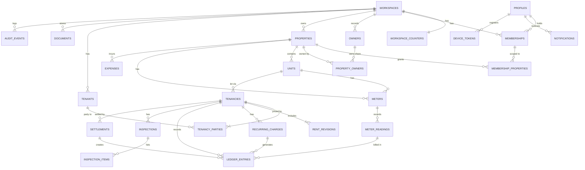

# 05 — Database Design

```text
Version:      0.1
Status:       Draft — awaiting owner review
Last Updated: 2026-09-18
Depends On:   04_DOMAIN_MODEL.md, 01_PRD.md (business rules)
Implements:   10_FINANCIAL_RULES.md §2–§3 (ledger constraints, FIFO view) — 10 is the authority for calculations
Affected By:  08_SYNC_SPECIFICATION.md, 10_FINANCIAL_RULES.md, 11_SECURITY_AND_PRIVACY.md, 16_DECISION_LOG.md
```

Database: **PostgreSQL 15+** (Supabase). Extensions: `pgcrypto` (UUIDs, hashing), `btree_gist` (overlap constraint), `pg_trgm` (search). All application tables live in schema **`app`**, which is **not exposed** through Supabase's auto-generated Data API. RLS is enabled with no policies, so it denies every client role (D-033, 11 §4).

## 1. Conventions

| Topic | Convention |
|---|---|
| Names | snake_case, plural table names, `*_id` foreign keys, `*_minor` for money, `*_on`/`*_date` for dates, `*_at` for timestamps |
| Primary keys | `id uuid`, generated by whoever creates the record (device, website or server) using UUID v4. No sequences for business rows. |
| Money | `bigint` minor units (paise, cents) + `currency text` ISO 4217. Never float. |
| Rates, meter values | `numeric` (exact). JSON transport as strings ("9.5000"). |
| Dates vs timestamps | Business dates are `date` (no time, no time zone). Technical times are `timestamptz` (UTC). |
| Enumerations | `text` + `CHECK (col IN (...))`. Easy to extend with a migration; no Postgres ENUM types. |
| Soft deletion | `deleted_at timestamptz` tombstone on every synced table (deletes must sync). Hard delete only by purge jobs. |
| Archiving | `archived_at timestamptz` where archiving exists (properties, units, tenants, meters). |
| Void | Money-like rows (`ledger_entries`, `meter_readings`, `expenses`) use `status ACTIVE/VOID` + `void_reason`, never delete. |

### 1.1 Standard columns ("sync columns")
Every table marked **[S]** (synced to Android) has:

| Column | Type | Null | Default | Notes |
|---|---|---|---|---|
| `id` | uuid | NO | — | PK |
| `workspace_id` | uuid | NO | — | FK → workspaces(id). For `workspaces` itself this column is absent and `id` is used. |
| `version` | bigint | NO | — | Set by trigger `app.stamp_version()` from the transaction's workspace change sequence. Pull cursor. |
| `created_at` | timestamptz | NO | now() | Server acceptance time |
| `updated_at` | timestamptz | NO | now() | Set by trigger |
| `created_by` | uuid | YES | — | profiles.id; NULL = system |
| `updated_by` | uuid | YES | — | |
| `deleted_at` | timestamptz | YES | — | Tombstone |

Index on every [S] table: `(workspace_id, version)`.

### 1.2 Triggers

| Trigger | Tables | Behaviour |
|---|---|---|
| `app.stamp_version()` BEFORE INSERT/UPDATE | all [S] | `NEW.version := current_setting('app.change_seq')::bigint` (raises if unset, so every write goes through the command layer); `NEW.updated_at := now()` |
| `app.ledger_guard()` BEFORE UPDATE/DELETE | ledger_entries | UPDATE may change only `note`, `reference`, `possible_duplicate_of`, and `status` ACTIVE→VOID with `void_*`; DELETE raises unless `app.purge = 'on'` |
| `app.append_only()` BEFORE UPDATE/DELETE | audit_events | Raises unless `app.purge = 'on'` |

The command layer starts every write transaction with:
```sql
UPDATE app.workspace_counters SET change_seq = change_seq + 1
 WHERE workspace_id = $1 RETURNING change_seq;          -- row lock serializes writers per workspace
SELECT set_config('app.change_seq', $seq::text, true);  -- local to the transaction
```

## 2. Tables

Legend: **PK** primary key, **FK** foreign key (ON DELETE behaviour in brackets; default RESTRICT), **UQ** unique, **IX** index, **CK** check. [S] = synced to Android. Standard sync columns are not repeated.

### 2.1 `profiles`
One row per auth user (`auth.users`). Not synced directly. Member names are copied onto `memberships`.

| Field | Type | Null | Default | Notes |
|---|---|---|---|---|
| id | uuid | NO | — | PK, = auth.users.id |
| full_name | text | NO | '' | CK length ≤ 100 |
| email | text | NO | — | verified, from auth |
| phone | text | YES | — | E.164 |
| locale | text | YES | — | BCP 47, e.g. en-IN |
| deletion_requested_at | timestamptz | YES | — | start of 30-day grace |
| terms_version | text | YES | — | accepted terms/privacy version (ACC-008) |
| terms_accepted_at | timestamptz | YES | — | |
| created_at / updated_at | timestamptz | NO | now() | |

### 2.2 `workspaces` [S]
| Field | Type | Null | Default | Notes |
|---|---|---|---|---|
| id | uuid | NO | — | PK |
| name | text | NO | — | CK 2–80 chars |
| country_code | text | NO | — | CK `^[A-Z]{2}$` |
| default_currency | text | NO | — | CK `^[A-Z]{3}$` |
| time_zone | text | NO | — | IANA name, validated in app |
| round_to_whole_units | boolean | NO | true | BR-016 |
| receipt_prefix | text | NO | 'R-' | CK ≤ 10 chars |
| receipt_footer | text | YES | — | ≤ 300 |
| landlord_name, landlord_address, landlord_phone, landlord_email | text | YES | — | printed on PDFs |
| payment_instructions | jsonb | YES | — | `{bank_details, payment_handle, payment_link, qr_document_id}` |
| digest_time | time | NO | '09:00' | default for members |
| storage_quota_bytes | bigint | NO | 1073741824 | 1 GB (D-053) |
| storage_used_bytes | bigint | NO | 0 | maintained by document commands |
| plan | text | NO | 'BETA' | CK IN (BETA, FREE, PAID, LOCKED) — V1 uses the latter three |
| deletion_requested_at | timestamptz | YES | — | |
| + sync columns | | | | |

### 2.3 `workspace_counters`
| Field | Type | Null | Default | Notes |
|---|---|---|---|---|
| workspace_id | uuid | NO | — | PK, FK → workspaces (CASCADE) |
| change_seq | bigint | NO | 0 | last version handed out |
| receipt_seq | bigint | NO | 0 | last receipt number |
| purge_floor | bigint | NO | 0 | highest version of tombstones removed by purge; clients below it must resync (08 §16.3) |

### 2.4 `memberships` [S]
| Field | Type | Null | Default | Notes |
|---|---|---|---|---|
| user_id | uuid | YES | — | FK → profiles; NULL while INVITED |
| role | text | NO | — | CK IN (OWNER, ADMIN, MANAGER, VIEWER, STAFF) |
| all_properties | boolean | NO | true | forced true for OWNER/ADMIN |
| status | text | NO | 'INVITED' | CK IN (INVITED, ACTIVE, REVOKED) |
| email | text | NO | — | invite email / member email |
| display_name | text | YES | — | copied from profile |
| invite_token_hash | text | YES | — | SHA-256; **never sent to clients** |
| invite_expires_at | timestamptz | YES | — | |
| invited_by | uuid | YES | — | |
| accepted_at, revoked_at | timestamptz | YES | — | |
| notification_prefs | jsonb | NO | '{}' | per-event toggles |
| digest_time | time | YES | — | overrides workspace default |
| + sync columns | | | | |

UQ `(workspace_id, user_id) WHERE status <> 'REVOKED' AND user_id IS NOT NULL` · UQ `(workspace_id, lower(email)) WHERE status = 'INVITED'` · UQ `(workspace_id) WHERE role = 'OWNER' AND status = 'ACTIVE'` · IX `(user_id)`

### 2.5 `membership_properties` [S]
| Field | Type | Null | Notes |
|---|---|---|---|
| membership_id | uuid | NO | FK → memberships (CASCADE) |
| property_id | uuid | NO | FK → properties |
| + sync columns | | | |

UQ `(membership_id, property_id) WHERE deleted_at IS NULL`

### 2.6 `owners` [S]
| Field | Type | Null | Notes |
|---|---|---|---|
| name | text | NO | CK 1–120 |
| phone | text | YES | E.164 |
| email | text | YES | |
| address | text | YES | |
| notes | text | YES | |
| + sync columns | | | |

### 2.7 `properties` [S]
| Field | Type | Null | Default | Notes |
|---|---|---|---|---|
| name | text | NO | — | CK 1–100 |
| type | text | NO | — | CK IN (RESIDENTIAL_BUILDING, INDEPENDENT_HOUSE, APARTMENT, PG_HOSTEL, COMMERCIAL, MIXED_USE, LAND, OTHER) |
| address_line1, address_line2, city, region, postal_code | text | YES | — | |
| country_code | text | NO | — | ISO 3166-1 alpha-2 |
| currency | text | NO | — | ISO 4217; locked when a tenancy exists (command check) |
| payment_instructions | jsonb | YES | — | override of workspace instructions |
| notes | text | YES | — | |
| archived_at | timestamptz | YES | — | |
| + sync columns | | | | |

UQ `(workspace_id, lower(name)) WHERE deleted_at IS NULL`

### 2.8 `property_owners` [S]
| Field | Type | Null | Notes |
|---|---|---|---|
| property_id | uuid | NO | FK → properties |
| owner_id | uuid | NO | FK → owners |
| share_bps | integer | NO | CK 1–10000 (100.00% = 10000) |
| + sync columns | | | |

UQ `(property_id, owner_id) WHERE deleted_at IS NULL`. The sum of 10000 per property is checked by the command (`PROP` tests), because a deferred multi-row constraint adds complexity for little gain.

### 2.9 `units` [S]
| Field | Type | Null | Default | Notes |
|---|---|---|---|---|
| property_id | uuid | NO | — | FK → properties |
| label | text | NO | — | CK 1–40 |
| type | text | NO | — | CK IN (FLAT, HOUSE, ROOM, BED, SHOP, OFFICE, WAREHOUSE, PARKING, OTHER) |
| floor_label | text | YES | — | grouping label ("Ground floor", "Block B") |
| area_value | numeric(10,2) | YES | — | |
| area_uom | text | YES | — | CK IN (SQFT, SQM) |
| default_rent_minor | bigint | YES | — | CK ≥ 0 |
| default_deposit_minor | bigint | YES | — | CK ≥ 0 |
| notes | text | YES | — | |
| archived_at | timestamptz | YES | — | |
| + sync columns | | | | |

UQ `(property_id, lower(label)) WHERE deleted_at IS NULL` · IX `(property_id)`

### 2.10 `tenants` [S]
| Field | Type | Null | Notes |
|---|---|---|---|
| kind | text | NO | CK IN (INDIVIDUAL, COMPANY), default INDIVIDUAL |
| full_name | text | NO | CK 1–120 |
| phone, alt_phone | text | YES | E.164 |
| email | text | YES | |
| address | text | YES | permanent/home address |
| emergency_name, emergency_phone | text | YES | |
| id_type | text | YES | CK IN (NATIONAL_ID, AADHAAR, PASSPORT, DRIVING_LICENCE, VOTER_ID, PAN, OTHER) |
| id_last4 | text | YES | CK length ≤ 4 — never the full number (D-025) |
| notes | text | YES | |
| archived_at | timestamptz | YES | |
| anonymized_at | timestamptz | YES | V1 |
| + sync columns | | | |

IX `(workspace_id, phone)` · IX `(workspace_id, lower(email))` · IX GIN `full_name gin_trgm_ops`

### 2.11 `tenancies` [S]
| Field | Type | Null | Default | Notes |
|---|---|---|---|---|
| property_id | uuid | NO | — | FK → properties; = unit's property |
| unit_id | uuid | NO | — | FK → units |
| status | text | NO | 'ACTIVE' | CK IN (ACTIVE, ENDED, CLOSED, CANCELLED) |
| currency | text | NO | — | copied from property, immutable |
| start_date | date | NO | — | move-in (or original start) |
| billing_start_date | date | NO | — | CK ≥ start_date |
| lease_end_date | date | YES | — | CK > start_date |
| cycle_day | smallint | NO | 1 | CK 1–28 |
| grace_days | smallint | NO | 4 | CK 0–60 |
| notice_period_days | smallint | YES | — | CK 0–365 |
| deposit_agreed_minor | bigint | NO | 0 | CK ≥ 0 (informational; deposit charges are the truth) |
| notice_given_on | date | YES | — | |
| notice_given_by | text | YES | — | CK IN (TENANT, LANDLORD) |
| planned_move_out_date | date | YES | — | CK ≥ start_date |
| moved_out_on | date | YES | — | CK ≥ start_date |
| closed_at | timestamptz | YES | — | |
| cancelled_at | timestamptz | YES | — | |
| cancel_reason | text | YES | — | |
| late_fee_rule | jsonb | YES | — | V1 `{type: FIXED|PERCENT, value, after_days}` |
| notes | text | YES | — | |
| occupancy | daterange | NO | generated | `GENERATED ALWAYS AS (daterange(start_date, COALESCE(moved_out_on, planned_move_out_date), '[]')) STORED` |
| + sync columns | | | | |

Constraint (BR-005):
```sql
ALTER TABLE app.tenancies ADD CONSTRAINT tenancies_no_overlap
  EXCLUDE USING gist (unit_id WITH =, occupancy WITH &&)
  WHERE (status <> 'CANCELLED' AND deleted_at IS NULL);
```
IX `(unit_id)` · IX `(workspace_id, status)` · IX `(property_id)`

### 2.12 `tenancy_parties` [S]
| Field | Type | Null | Notes |
|---|---|---|---|
| property_id | uuid | NO | copied from tenancy (scoping) |
| tenancy_id | uuid | NO | FK → tenancies |
| tenant_id | uuid | NO | FK → tenants |
| role | text | NO | CK IN (PRIMARY, CO_TENANT, OCCUPANT) |
| joined_on, left_on | date | YES | |
| + sync columns | | | |

UQ `(tenancy_id, tenant_id) WHERE deleted_at IS NULL` · UQ `(tenancy_id) WHERE role = 'PRIMARY' AND left_on IS NULL AND deleted_at IS NULL` · IX `(tenant_id)`

### 2.13 `rent_revisions` [S]
| Field | Type | Null | Notes |
|---|---|---|---|
| property_id | uuid | NO | scoping |
| tenancy_id | uuid | NO | FK → tenancies |
| effective_from | date | NO | billing start or a period start (command check) |
| rent_minor | bigint | NO | CK > 0 |
| reason | text | YES | |
| + sync columns | | | |

UQ `(tenancy_id, effective_from) WHERE deleted_at IS NULL`

### 2.14 `recurring_charges` [S]
| Field | Type | Null | Notes |
|---|---|---|---|
| property_id | uuid | NO | scoping |
| tenancy_id | uuid | NO | FK → tenancies |
| category | text | NO | CK IN (MAINTENANCE, PARKING, UTILITY, TAX, OTHER) |
| label | text | NO | CK 1–60 |
| amount_minor | bigint | NO | CK > 0 |
| effective_from | date | NO | |
| effective_to | date | YES | CK ≥ effective_from |
| + sync columns | | | |

### 2.15 `ledger_entries` [S]
The single money table (D-021). Allowed combinations are defined in `10_FINANCIAL_RULES.md` §2 and enforced by CHECK constraints.

| Field | Type | Null | Default | Notes |
|---|---|---|---|---|
| property_id | uuid | NO | — | scoping |
| tenancy_id | uuid | NO | — | FK → tenancies |
| kind | text | NO | — | CK IN (CHARGE, PAYMENT, CREDIT, REFUND, DEPOSIT_APPLIED) |
| account | text | NO | — | CK IN (RENT, DEPOSIT); DEPOSIT_APPLIED uses RENT |
| category | text | YES | — | charges: RENT, UTILITY, DEPOSIT, LATE_FEE, MAINTENANCE, PARKING, DAMAGE, CLEANING, TAX, OPENING_BALANCE, OTHER; credits: DISCOUNT, WAIVER, PRORATION, ADJUSTMENT, WRITE_OFF, OPENING_ADVANCE |
| amount_minor | bigint | NO | — | CK > 0 AND ≤ 10^15 |
| currency | text | NO | — | = tenancy currency (command check) |
| entry_date | date | NO | — | posting date / date received |
| due_date | date | YES | — | CK required when kind = CHARGE |
| period_start, period_end | date | YES | — | rent/recurring/utility periods |
| description | text | YES | — | e.g. "Rent · Oct 2026" |
| method | text | YES | — | CK IN (CASH, BANK_TRANSFER, UPI, CHEQUE, CARD, MOBILE_WALLET, OTHER, OPENING_BALANCE, INTERNAL_TRANSFER); required for PAYMENT/REFUND |
| reference | text | YES | — | editable |
| note | text | YES | — | editable |
| receipt_number | text | YES | — | set by server on accepted PAYMENTs except OPENING_BALANCE/INTERNAL_TRANSFER |
| source | text | NO | 'MANUAL' | CK IN (MANUAL, AUTO, MOVE_IN, SETTLEMENT, OPENING, REVISION) |
| generated_key | text | YES | — | UQ; e.g. `rent:<tenancy>:<period_start>` |
| recurring_charge_id | uuid | YES | — | FK → recurring_charges |
| meter_reading_id | uuid | YES | — | FK → meter_readings (closing reading) |
| previous_reading_id | uuid | YES | — | FK → meter_readings |
| quantity | numeric(14,3) | YES | — | utility consumption |
| rate | numeric(12,4) | YES | — | utility rate snapshot |
| fixed_amount_minor | bigint | YES | — | utility fixed-charge snapshot |
| settlement_id | uuid | YES | — | FK → settlements |
| related_entry_id | uuid | YES | — | FK → ledger_entries (e.g. revision adjustment ↔ charge, bounce fee ↔ payment) |
| status | text | NO | 'ACTIVE' | CK IN (ACTIVE, VOID) |
| void_reason | text | YES | — | CK required when VOID |
| voided_at | timestamptz | YES | — | |
| voided_by | uuid | YES | — | |
| possible_duplicate_of | uuid | YES | — | set by server (PAY-006) |
| + sync columns | | | | `deleted_at` never used |

Indexes:
- IX `(tenancy_id, account, status)` (balances, FIFO)
- IX `(workspace_id, kind, entry_date)` (reports)
- IX `(property_id, entry_date)`
- UQ `(workspace_id, receipt_number) WHERE receipt_number IS NOT NULL`
- UQ `(generated_key) WHERE generated_key IS NOT NULL`, including VOID rows (voided generated charges are never re-created)
- IX `(tenancy_id, kind, amount_minor, entry_date) WHERE status = 'ACTIVE'` (duplicate detection)

### 2.16 `meters` [S]
| Field | Type | Null | Default | Notes |
|---|---|---|---|---|
| property_id | uuid | NO | — | FK → properties |
| unit_id | uuid | YES | — | FK → units; NULL = common meter |
| type | text | NO | — | CK IN (ELECTRICITY, WATER, GAS, OTHER) |
| label | text | NO | — | CK 1–40 |
| serial_number | text | YES | — | |
| uom | text | NO | — | CK IN (KWH, M3, LITRE, UNIT) |
| rate | numeric(12,4) | NO | 0 | per uom, major currency units; CK ≥ 0 |
| fixed_charge_minor | bigint | NO | 0 | CK ≥ 0 |
| currency | text | NO | — | = property currency |
| notes | text | YES | — | |
| archived_at | timestamptz | YES | — | |
| + sync columns | | | | |

UQ `(property_id, COALESCE(unit_id, '00000000-0000-0000-0000-000000000000'::uuid), lower(label)) WHERE deleted_at IS NULL`

### 2.17 `meter_readings` [S]
| Field | Type | Null | Default | Notes |
|---|---|---|---|---|
| property_id | uuid | NO | — | scoping |
| meter_id | uuid | NO | — | FK → meters |
| tenancy_id | uuid | YES | — | FK → tenancies (MOVE_IN/MOVE_OUT and billed readings) |
| reading_date | date | NO | — | |
| value | numeric(14,3) | NO | — | CK ≥ 0 |
| reading_type | text | NO | 'REGULAR' | CK IN (MOVE_IN, REGULAR, MOVE_OUT, METER_END, METER_START) |
| note | text | YES | — | |
| status | text | NO | 'ACTIVE' | CK IN (ACTIVE, VOID) |
| void_reason | text | YES | — | |
| + sync columns | | | | |

UQ `(meter_id, reading_date, reading_type) WHERE status = 'ACTIVE'` · IX `(meter_id, reading_date)`. Monotonic values (BR-017) are checked by the command using the previous ACTIVE reading.

### 2.18 `expenses` [S]
| Field | Type | Null | Default | Notes |
|---|---|---|---|---|
| property_id | uuid | YES | — | FK → properties; NULL = workspace-level |
| unit_id | uuid | YES | — | FK → units |
| category | text | NO | — | CK IN (REPAIR, MAINTENANCE, UTILITY, PROPERTY_TAX, INSURANCE, SALARY, COMMISSION, LEGAL, LOAN_INTEREST, OTHER) |
| amount_minor | bigint | NO | — | CK > 0 |
| currency | text | NO | — | |
| expense_date | date | NO | — | |
| payee | text | YES | — | |
| method | text | YES | — | same list as ledger methods (without system values) |
| reference, note | text | YES | — | |
| status | text | NO | 'ACTIVE' | CK IN (ACTIVE, VOID) |
| void_reason | text | YES | — | |
| + sync columns | | | | |

IX `(workspace_id, expense_date)` · IX `(property_id, expense_date)`

### 2.19 `documents` [S]
| Field | Type | Null | Default | Notes |
|---|---|---|---|---|
| property_id | uuid | YES | — | scoping (NULL for workspace/tenant-only docs) |
| entity_type | text | NO | — | CK IN (WORKSPACE, PROPERTY, UNIT, TENANT, TENANCY, LEDGER_ENTRY, EXPENSE, METER_READING, INSPECTION, INSPECTION_ITEM) |
| entity_id | uuid | NO | — | polymorphic (no FK; checked by command) |
| category | text | NO | — | CK IN (AGREEMENT, ID_PROOF, ADDRESS_PROOF, POLICE_VERIFICATION, PAYMENT_PROOF, BILL, PHOTO, PAYMENT_QR, OTHER) |
| title | text | YES | — | |
| file_name | text | NO | — | original name |
| mime_type | text | NO | — | CK IN (image/jpeg, image/png, image/webp, application/pdf) |
| size_bytes | bigint | NO | — | CK 1–10485760 |
| storage_path | text | NO | — | `ws/<workspace_id>/<document_id>` |
| sensitive | boolean | NO | false | forced true for ID_PROOF, ADDRESS_PROOF, POLICE_VERIFICATION |
| upload_status | text | NO | 'PENDING' | CK IN (PENDING, UPLOADED) |
| uploaded_at | timestamptz | YES | — | |
| visible_to_tenant | boolean | NO | false | V1 |
| + sync columns | | | | `deleted_at` = soft delete (purged after 30 days) |

IX `(entity_type, entity_id)` · IX `(workspace_id) WHERE deleted_at IS NOT NULL`

### 2.20 `inspections` [S]
| Field | Type | Null | Notes |
|---|---|---|---|
| property_id | uuid | NO | scoping |
| tenancy_id | uuid | NO | FK → tenancies |
| kind | text | NO | CK IN (MOVE_IN, MOVE_OUT) |
| inspected_on | date | NO | |
| keys_count | smallint | YES | CK ≥ 0 |
| notes | text | YES | |
| completed_at | timestamptz | YES | |
| + sync columns | | | |

UQ `(tenancy_id, kind) WHERE deleted_at IS NULL`

### 2.21 `inspection_items` [S]
| Field | Type | Null | Notes |
|---|---|---|---|
| property_id | uuid | NO | scoping |
| inspection_id | uuid | NO | FK → inspections (CASCADE) |
| area | text | NO | CK 1–60 |
| item | text | NO | CK 1–80 |
| condition | text | YES | CK IN (GOOD, FAIR, DAMAGED, MISSING, NOT_APPLICABLE) |
| note | text | YES | |
| sort_order | integer | NO | |
| + sync columns | | | |

IX `(inspection_id, sort_order)`

### 2.22 `settlements` [S]
| Field | Type | Null | Default | Notes |
|---|---|---|---|---|
| property_id | uuid | NO | — | scoping |
| tenancy_id | uuid | NO | — | FK → tenancies |
| status | text | NO | 'DRAFT' | CK IN (DRAFT, FINALIZED, VOID) |
| move_out_date | date | NO | — | |
| lines | jsonb | NO | '[]' | proposed/confirmed lines (10 §10) |
| rent_balance_before_minor | bigint | YES | — | snapshot at finalize |
| deductions_minor | bigint | YES | — | |
| deposit_held_minor | bigint | YES | — | |
| deposit_applied_minor | bigint | YES | — | |
| refund_due_minor | bigint | YES | — | |
| amount_owed_minor | bigint | YES | — | |
| finalized_at | timestamptz | YES | — | |
| finalized_by | uuid | YES | — | |
| voided_at, voided_by, void_reason | — | YES | — | reopen |
| + sync columns | | | | |

UQ `(tenancy_id) WHERE status IN ('DRAFT', 'FINALIZED')`

### 2.23 `notifications` [S, per user]
| Field | Type | Null | Notes |
|---|---|---|---|
| user_id | uuid | NO | FK → profiles |
| type | text | NO | 12 §3 catalogue id |
| title, body | text | NO | |
| data | jsonb | NO | deep-link target |
| dedupe_key | text | NO | e.g. `digest:<ws>:<date>` |
| read_at | timestamptz | YES | |
| + sync columns | | | |

UQ `(user_id, dedupe_key)`. Pulled only by their user. Retention 180 days.

### 2.24 `device_tokens`
| Field | Type | Null | Notes |
|---|---|---|---|
| id | uuid | NO | PK |
| user_id | uuid | NO | FK → profiles (CASCADE) |
| platform | text | NO | CK IN (ANDROID, WEB) |
| token | text | NO | UQ |
| app_version | text | YES | |
| last_seen_at | timestamptz | NO | |
| created_at | timestamptz | NO | |

### 2.25 `audit_events`
Append-only (trigger).

| Field | Type | Null | Notes |
|---|---|---|---|
| id | bigint | NO | PK, identity |
| workspace_id | uuid | NO | FK → workspaces (CASCADE on purge) |
| actor_user_id | uuid | YES | NULL for jobs |
| actor_label | text | YES | name snapshot; "Former member" after deletion |
| source | text | NO | CK IN (WEB, ANDROID, JOB, SYSTEM) |
| action | text | NO | e.g. CREATE, UPDATE, VOID, DELETE, ARCHIVE, VIEW_SENSITIVE, EXPORT, FINALIZE, REOPEN, INVITE, ROLE_CHANGE |
| entity_type | text | NO | table name |
| entity_id | uuid | YES | |
| changes | jsonb | YES | `{field: [before, after]}` |
| op_id | uuid | YES | sync op |
| request_id | text | YES | |
| created_at | timestamptz | NO | now() |

IX `(workspace_id, created_at DESC)` · IX `(workspace_id, entity_type, entity_id)`

### 2.26 `sync_ops`
Idempotency record for pushed operations (08 §7).

| Field | Type | Null | Notes |
|---|---|---|---|
| op_id | uuid | NO | PK |
| workspace_id | uuid | NO | |
| user_id | uuid | NO | |
| device_id | text | NO | |
| op_type | text | NO | |
| status | text | NO | CK IN (APPLIED, REJECTED) |
| result | jsonb | NO | full response for this op |
| received_at | timestamptz | NO | now(); IX for cleanup (retention 90 days) |

## 3. Version 1 tables (designed now, created by V1 migrations)

| Table | Key fields | Constraints |
|---|---|---|
| `tenant_links` [S] | tenant_id, user_id, invite_phone, invite_email, status (INVITED/ACTIVE/REVOKED), invite_token_hash | UQ (tenant_id, user_id) active |
| `notices` [S] | title, body, audience (ALL/PROPERTIES/UNITS), target_ids uuid[], published_at, expires_at | |
| `notice_reads` | notice_id, user_id, read_at | PK (notice_id, user_id) |
| `conversations` [S] | property_id, tenancy_id, last_message_at | UQ (tenancy_id) |
| `messages` [S] | conversation_id, sender_user_id, sender_kind (MEMBER/TENANT), kind (TEXT/IMAGE/FILE/PAYMENT_CARD), body, document_id, payload jsonb | IX (conversation_id, created_at) |
| `message_reads` | conversation_id, user_id, last_read_at | PK (conversation_id, user_id) |
| `payment_claims` [S] | tenancy_id, submitted_by, amount_minor, currency, paid_on, method, reference, note, status (SUBMITTED/ACCEPTED/REJECTED), decided_by, decided_at, reject_reason, payment_entry_id | |
| `subscriptions` | workspace_id PK, provider, customer id, subscription id, status, quantity, current_period_end | |

The MVP schema already has what these need: `documents.visible_to_tenant`, `workspaces.plan`, the STAFF role value, and `tenancies.late_fee_rule`.

## 4. Relationships

| Type | Relationship |
|---|---|
| One-to-one | workspaces ↔ workspace_counters; (V1) tenancies ↔ conversations; (V1) workspaces ↔ subscriptions |
| One-to-many | workspace → memberships, owners, properties, tenants, expenses, documents, audit_events; property → units, meters, expenses; unit → tenancies, meters; tenancy → tenancy_parties, rent_revisions, recurring_charges, ledger_entries, inspections, settlements; meter → meter_readings; inspection → inspection_items; settlement → ledger_entries; recurring_charge → ledger_entries; meter_reading → ledger_entries |
| Many-to-many | memberships ↔ properties (membership_properties); owners ↔ properties (property_owners); tenants ↔ tenancies (tenancy_parties) |
| Polymorphic | documents → any entity (entity_type, entity_id) |

## 5. ER diagram



## 6. Key queries (reference implementations)

### 6.1 FIFO allocation view (server)
Implements `10_FINANCIAL_RULES.md` §3 exactly. The Android Kotlin engine must return identical results for the shared test vectors.

```sql
CREATE VIEW app.v_charge_allocation AS
WITH pool AS (
  SELECT tenancy_id,
         SUM(CASE WHEN kind IN ('PAYMENT','CREDIT','DEPOSIT_APPLIED') THEN amount_minor
                  WHEN kind = 'REFUND' THEN -amount_minor END) AS credits
  FROM app.ledger_entries
  WHERE account = 'RENT' AND status = 'ACTIVE' AND kind <> 'CHARGE'
  GROUP BY tenancy_id
), charges AS (
  SELECT e.*,
         COALESCE(SUM(amount_minor) OVER (
           PARTITION BY tenancy_id
           ORDER BY due_date,
                    CASE category WHEN 'OPENING_BALANCE' THEN 0 WHEN 'RENT' THEN 1
                                  WHEN 'UTILITY' THEN 2 ELSE 3 END,
                    id
           ROWS BETWEEN UNBOUNDED PRECEDING AND 1 PRECEDING), 0) AS cum_before
  FROM app.ledger_entries e
  WHERE account = 'RENT' AND kind = 'CHARGE' AND status = 'ACTIVE'
)
SELECT c.id, c.tenancy_id, c.amount_minor, c.due_date,
       GREATEST(0, LEAST(c.amount_minor, COALESCE(p.credits, 0) - c.cum_before)) AS paid_minor,
       c.amount_minor - GREATEST(0, LEAST(c.amount_minor, COALESCE(p.credits, 0) - c.cum_before)) AS remaining_minor
FROM charges c LEFT JOIN pool p USING (tenancy_id);
```

### 6.2 Balances
```sql
SELECT tenancy_id,
  SUM(CASE WHEN account='RENT' AND kind IN ('CHARGE','REFUND') THEN amount_minor
           WHEN account='RENT' AND kind IN ('PAYMENT','CREDIT','DEPOSIT_APPLIED') THEN -amount_minor
           ELSE 0 END) AS rent_balance_minor,
  SUM(CASE WHEN account='DEPOSIT' AND kind='PAYMENT' THEN amount_minor
           WHEN account='DEPOSIT' AND kind='REFUND' THEN -amount_minor
           WHEN kind='DEPOSIT_APPLIED' THEN -amount_minor ELSE 0 END) AS deposit_held_minor,
  SUM(CASE WHEN account='DEPOSIT' AND kind='CHARGE' THEN amount_minor
           WHEN account='DEPOSIT' AND kind IN ('PAYMENT','CREDIT') THEN -amount_minor
           ELSE 0 END) AS deposit_due_minor
FROM app.ledger_entries WHERE status = 'ACTIVE' GROUP BY tenancy_id;
```

"As of date D" variants add `AND entry_date <= D`.

## 7. Why the design is this way

| Decision | Reason |
|---|---|
| One `ledger_entries` table instead of charges/payments/credits tables | Balances are one `SUM`, statements are one `ORDER BY`, sync has one money entity, and voids and audit work the same for all money. The master prompt's financial requirements (partial, advance, refunds, corrections, cancellations) all fit as entry kinds. |
| Charge status not stored | Stored statuses go stale when a payment is voided or synced late. FIFO derivation is deterministic and cheap per tenancy. A cached balances table can be added if dashboards slow down (> 5,000 tenancies). |
| Client-generated UUIDs | Records created offline need final IDs immediately. Duplicate retries are harmless because the ID is the same. |
| Per-workspace `change_seq` + row lock | Gives a gap-free, commit-ordered version for sync cursors (`08` §5). This is correct without clock trust. The cost is serialized writes per workspace, acceptable for this workload (tens of writes/minute per workspace). |
| `deleted_at` tombstones everywhere | Deletes must reach offline devices. Purge jobs remove rows later. |
| `workspace_id` (and `property_id`) on every row | Isolation checks and scoped sync filters without joins; indexes support both. |
| Exclusion constraint for tenancy overlap | Two offline devices can create conflicting tenancies. Only a database constraint is race-proof. |
| `generated_key` unique incl. voided rows | The job is idempotent, and a voided period (free month) is never billed again. |
| text + CHECK instead of ENUM | Adding values is a simple migration; the same strings are used in JSON and Kotlin. |
| JSONB only for settlement lines, payment instructions, preferences, audit changes | These are documents read and written whole. Everything queried or constrained is a column. |
| Non-exposed `app` schema + RLS deny-all | Supabase's automatic Data API cannot leak tables even if a key is misused. The API is the single enforcement point (`11` §4). |
| Polymorphic documents without FK | One documents table and one upload flow for ten parent types. Parent existence is checked by the command; orphan cleanup runs in the purge job. |

## 8. Android local database (Room)

The Room schema mirrors every [S] table with the same column names. Types map as follows: uuid → TEXT, date → TEXT `yyyy-MM-dd`, timestamptz → INTEGER epoch ms, bigint → INTEGER, numeric → INTEGER thousandths for meter values (`value_milli`) and TEXT decimal for rates (parsed with `BigDecimal`), jsonb → TEXT. Local-only tables (`pending_ops`, `sync_state`, `local_files`) and the column `local_status` (SYNCED/PENDING/FAILED) are specified in `08_SYNC_SPECIFICATION.md` §4. Room schema JSON is exported and versioned; migrations are written for every change.

## 9. Migrations, retention, sizing

- **Migrations:** forward-only SQL files in the repository (`web/db/migrations/NNNN_name.sql`), generated by Drizzle Kit and hand-edited for constraints, triggers and RLS. They are applied in CI to staging, then production. Every migration must be backward compatible with the previous Android release (add columns nullable, never rename in one step).
- **Retention:** sync_ops 90 days; notifications 180 days; files of soft-deleted documents purged after 30 days (no restore after that); tombstone rows of any [S] table may be removed after 90 days, raising `workspace_counters.purge_floor`; audit_events for the workspace lifetime; purged workspaces removed completely (incl. audit).
- **Sizing estimate:** a 500-unit workspace with 5 years of history has about 500 × 60 × 2.5 ≈ 75,000 ledger rows (~30 MB incl. indexes). 1,000 such workspaces ≈ 30 GB. That exceeds the Supabase Pro base disk, but typical workspaces are much smaller. Monitor and plan the upgrade path (06 §12).
