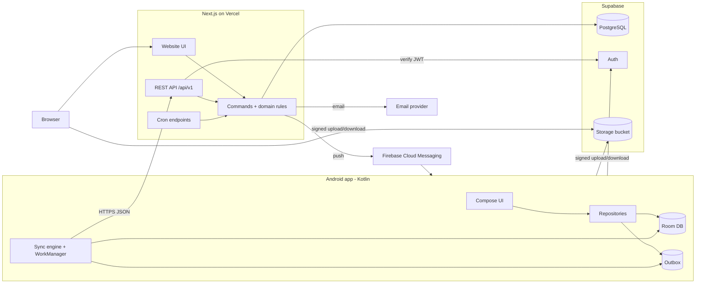

# 06 — System Architecture

```text
Version:      0.1
Status:       Draft — awaiting owner review
Last Updated: 2026-09-18
Depends On:   01_PRD.md, 04_DOMAIN_MODEL.md, 05_DATABASE_DESIGN.md
Affected By:  08_SYNC_SPECIFICATION.md, 11_SECURITY_AND_PRIVACY.md, 16_DECISION_LOG.md
```

## 1. Summary

A **modular monolith**: one Next.js application serves the website **and** the REST API, runs scheduled jobs, and talks to one PostgreSQL database. The Android app is a native Kotlin client with its own offline database that syncs through the same API. Supabase provides managed PostgreSQL, authentication and file storage. There are no microservices, queues, Kubernetes or custom servers to operate (master prompt §7).

The stack was confirmed by the owner on 2026-09-18 (D-006).



Reading the diagram: every business rule runs inside **Commands** on the server. The phone and the website are two clients of the same commands, so they cannot diverge (master prompt §6). Files go directly between clients and storage using short-lived signed URLs that the API issues after checking permissions.

## 2. Components and responsibilities

| Component | Responsibility | Does not |
|---|---|---|
| Android app | Offline-first UI, local DB, outbox, sync, camera/photo capture, local money engine (display only), push reception | Decide final truth, generate rent charges, assign receipt numbers |
| Website (Next.js UI) | Full management UI, reports, exports, team admin, audit log | Work offline |
| REST API (Next.js route handlers) | Authentication check, authorization, validation, commands, queries, sync endpoints, signed URLs | Hold state between requests |
| Commands (server module) | All writes: invariants, versioning, audit, idempotency | — |
| Jobs (cron endpoints) | Rent generation, digests, cleanup, purge, storage reconciliation | Long-running work beyond one tenancy/workspace per transaction |
| PostgreSQL | Source of truth; constraints (overlap, uniqueness, immutability) | Business logic beyond constraints and the FIFO view |
| Supabase Auth | Identity, Google and email-code sign-in, tokens | Authorization (our API does it) |
| Supabase Storage | Private file storage | Access decisions (API signs URLs) |
| FCM | Push delivery to Android | — |
| Email provider | Transactional email (codes, invites, notices) | Marketing |

## 3. Technology comparison

### 3.1 Mobile

| Option | Pros | Cons | Verdict |
|---|---|---|---|
| **Native Kotlin + Jetpack Compose** | Owner's existing skill; best offline tooling (Room, WorkManager); best Android performance; KMP path to iOS later | Android only | **Chosen** (D-006, D-031) |
| React Native (Expo) | Android + iOS; TypeScript shared with web | New skill; offline DB/queue libraries less mature than Room/WorkManager | Rejected by owner |
| Flutter | Android + iOS | Dart as a third language; Flutter web weak for data-heavy admin | Rejected |
| Kotlin Multiplatform now | Shared logic for future iOS | More setup now for an iOS app not in scope | Later (D-007) |

Compose vs XML Views: Compose is the current Android standard and makes forms, lists and state easier. The owner has XML experience, but a new app in 2026 should use Compose (D-031, PROVISIONAL).

### 3.2 Web

| Option | Verdict |
|---|---|
| **Next.js (App Router, TypeScript)** | **Chosen**. Owner has used it; same app hosts the API; server components simplify reads. |
| React SPA (Vite) + separate API | Two deployables for no gain. |

### 3.3 Backend

| Option | Pros | Cons | Verdict |
|---|---|---|---|
| **Next.js route handlers + PostgreSQL** | One TypeScript codebase for web + API; business rules testable in code; one deployment | Serverless time limits for long jobs | **Chosen** |
| Supabase only (RLS + SQL functions, clients talk to DB) | Fewest moving parts | Money rules and sync logic in PL/pgSQL; harder to test and evolve; RLS for scoped roles gets complex | Rejected |
| Firebase (Firestore + Functions) | Built-in offline sync | NoSQL makes ledgers, FIFO, reports and exports hard; per-read pricing grows with dashboards; last-write-wins per field on money | Rejected |
| Kotlin (Ktor/Spring) + PostgreSQL | Share Kotlin money code with Android | JVM server to host and operate; web still separate | Rejected for MVP |

### 3.4 Database

PostgreSQL. It is relational (ledger, joins, window functions for FIFO, reports), has exclusion constraints (tenancy overlap), and gives strong transactional guarantees. MySQL lacks exclusion constraints; document stores lack joins and constraints.

### 3.5 Authentication

| Option | Verdict |
|---|---|
| **Supabase Auth** | **Chosen**. Included with the database; Google, email OTP, phone OTP (V1); JWTs verifiable via JWKS. |
| Firebase Auth | Good, but a second vendor for identity. |
| Clerk/Auth0 | Polished but paid per user at scale. |
| Self-built (Auth.js + DB) | More security surface to own. |

### 3.6 File storage

**Supabase Storage** (S3-compatible, private buckets, signed upload/download URLs) is chosen. It can move to S3 or R2 later without client changes, because clients only receive signed URLs.

### 3.7 Other services

| Need | Choice | Alternatives |
|---|---|---|
| Push (Android) | Firebase Cloud Messaging (HTTP v1) | — |
| Transactional email | Resend (PROVISIONAL) | Postmark, Amazon SES |
| Scheduled jobs | Vercel Cron (Pro plan) calling internal endpoints | Supabase `pg_cron` + `pg_net` calling the same endpoints; GitHub Actions schedule |
| PDF generation | `@react-pdf/renderer` on the server | pdf-lib; headless Chrome (too heavy) |
| Errors and performance | Sentry (Android + Next.js) | Firebase Crashlytics (Android only) |
| Uptime | Better Stack / UptimeRobot free tier | — |
| Off-site backups | GitHub Actions → encrypted dump → Cloudflare R2 or Backblaze B2 | — |

## 4. Recommended stack (final)

| Layer | Technology |
|---|---|
| Android | Kotlin, Jetpack Compose + Material 3, Navigation Compose, Hilt, Room, WorkManager, Retrofit + OkHttp + kotlinx.serialization, supabase-kt (auth module only), Android Credential Manager (Google sign-in), Coil (images), Firebase Messaging, BiometricPrompt, DataStore, libphonenumber-android, Sentry; minSdk 26, target latest |
| Web UI | Next.js (App Router), TypeScript, Tailwind CSS, shadcn/ui, react-hook-form + Zod, TanStack Table, next-intl (English only at launch), @supabase/ssr, Sentry |
| API | Next.js route handlers (Node runtime), Zod validation, Drizzle ORM + postgres.js, jose (JWT/JWKS), @react-pdf/renderer, firebase-admin (FCM), Resend SDK |
| Database | Supabase PostgreSQL 15+ with pgcrypto, btree_gist, pg_trgm; connections through Supavisor pooler (transaction mode) |
| Auth | Supabase Auth: Google, email OTP; phone OTP in V1 |
| Files | Supabase Storage, private bucket `documents` |
| Hosting | Vercel (Pro) in the region closest to the database region |
| CI/CD | GitHub + GitHub Actions |

All choices other than D-006 are PROVISIONAL and recorded in `16_DECISION_LOG.md`.

## 5. Android architecture

```text
ui/            Compose screens, ViewModels (StateFlow), components, theme tokens
domain/        Pure Kotlin, no android.* imports:
               MoneyEngine (FIFO, balances, deposit figures, aging)
               Proration, UtilityCalc, SettlementCalc, RentSchedule
               Validators (same rules as server Zod schemas)
data/          Room database + DAOs, Repositories (one per aggregate),
               ApiClient (Retrofit), AuthManager (supabase-kt)
sync/          Outbox writer, PushWorker, PullWorker, UploadWorker, SyncCoordinator,
               ConflictRebaser, AccessChangeHandler
di/            Hilt modules
```

- **Single-activity** Compose app, one navigation graph, bottom navigation with 5 tabs (09 §2).
- **All reads come from Room.** Screens never wait for the network. Writes go to Room and the outbox in one Room transaction (08 §6).
- **domain/** is covered by JVM unit tests that run the shared `spec/financial-vectors.json`.
- **WorkManager**: unique work `sync` (network required, exponential backoff), periodic `sync-periodic` (15 min), `upload-files` (network required), `sync-reminder` (daily local check).
- **Security**: tokens in EncryptedSharedPreferences/DataStore with Android Keystore; DB and files in app-private storage; optional biometric lock (D-038).
- **Build flavors**: `staging` and `production` (different API base URL, Supabase project, FCM project).

## 6. Web and API architecture

```text
web/src/
  app/(auth)/...            sign-in pages
  app/(app)/[ws]/...        workspace pages (server components read via queries/)
  app/api/v1/...            REST route handlers (thin)
  app/api/internal/cron/... job endpoints (secret-protected)
  server/
    auth/                   verifyRequest(): JWT from cookie (web) or Bearer (Android) via JWKS
    authz/                  can(member, action, resource) — implements 01 §12 matrix
    commands/               one module per command (createPayment, startTenancy, finalizeSettlement…)
    queries/                read models (dashboard, ledger with FIFO view, reports)
    domain/                 proration, utility, settlement, schedule (pure TS; runs shared vectors)
    sync/                   pull assembler, push dispatcher (maps op types → commands)
    pdf/                    receipt, statement, settlement templates
    notify/                 fcm, email, in-app notifications
  db/schema.ts, db/migrations/
```

**Request pipeline (every write):**

```mermaid
sequenceDiagram
    participant C as Client (web/Android)
    participant H as Route handler
    participant A as Auth + Authz
    participant K as Command
    participant D as PostgreSQL
    C->>H: POST /api/v1/workspaces/{ws}/tenancies/{id}/payments
    H->>A: verify JWT, load membership, can(member, "payment.create", tenancy)
    A-->>H: ok / 401 / 403
    H->>K: validated input (Zod)
    K->>D: BEGIN; lock workspace counter; set app.change_seq
    K->>D: check invariants; INSERT entry; assign receipt no.; INSERT audit
    K->>D: COMMIT
    K-->>H: canonical entity
    H-->>C: 201 + JSON
```

- The web client uses the same REST endpoints for mutations as Android (one validation path). Server components call `queries/` directly for reads, through the same `authz` checks.
- Errors use `application/problem+json` with stable codes (07 §1.6).

## 7. Database access

- Drizzle ORM (typed queries) with postgres.js through Supabase's pooler in transaction mode. A dedicated DB role `app_api` owns the `app` schema, and RLS is enabled with no policies. `anon` and `authenticated` roles get no privileges on `app`.
- The Vercel function region must equal the Supabase region (latency).
- Long reports stream results with cursors.

## 8. File storage

| Aspect | Design |
|---|---|
| Bucket | `documents`, private |
| Path | `ws/<workspace_id>/<document_id>` (no user-controlled names in paths) |
| Upload | 1) client creates document metadata (op or POST) → 2) `POST /documents/{id}/upload-url` returns a signed upload URL (valid 2 h) → 3) client PUTs the file → 4) `POST /documents/{id}/complete` verifies object size and type, marks UPLOADED, updates storage usage |
| Download | `GET /documents/{id}/download-url` → signed URL valid 5 min; sensitive → audit event |
| Validation | MIME allow-list, ≤ 10 MB, server re-checks object metadata on complete |
| Images | Android compresses to ≤ 1920 px JPEG q80 before upload; the website resizes in the browser with a canvas before upload |
| Quota | Checked when an upload URL is requested; usage updated on complete/purge; weekly reconciliation job |
| Purge | Daily job deletes files of documents soft-deleted > 30 days and of purged workspaces |

## 9. Authentication and sessions

- **Web:** Supabase Auth with @supabase/ssr (session in httpOnly cookies). Route handlers verify the access token locally with the JWKS public keys.
- **Android:** Google sign-in via Credential Manager → Google ID token → Supabase `signInWithIdToken`. Email OTP via Supabase endpoints. Access token (~1 h) + refresh token (rotating) stored encrypted. Every API call sends `Authorization: Bearer <access token>`.
- **Sign out of all devices:** Supabase global sign-out revokes refresh tokens. Access tokens expire within the hour.
- **Account deletion:** after the grace period, the purge job deletes the auth user through the Supabase admin API (service key on server only).

## 10. Background jobs

All jobs are idempotent HTTP endpoints under `/api/internal/cron/*`, protected by `Authorization: Bearer <CRON_SECRET>`, invoked by Vercel Cron. Each processes work in small transactions and can be re-run safely.

| Job | Schedule | Work | Idempotency |
|---|---|---|---|
| `generate-charges` | hourly | For each workspace (local date), create missing rent/recurring charges per ACTIVE tenancy (FL-08) | `generated_key` UNIQUE |
| `digests` | every 15 min | Members whose digest time passed today (their time zone) and who have not received today's digest → compute counts → in-app + push | `notifications (user_id, dedupe_key)` UNIQUE |
| `cleanup` | daily 02:00 UTC | Delete sync_ops > 90 d, notifications > 180 d, expired invites; delete files of documents deleted > 30 d; remove tombstone rows > 90 d and raise `purge_floor`; purge workspaces/accounts past grace | Deleting already-deleted rows is a no-op |
| `storage-reconcile` | weekly | Recompute `storage_used_bytes` from documents | Overwrites value |
| `backup` (GitHub Actions) | weekly | `pg_dump` → encrypt (age) → upload off-site; mirror storage bucket (rclone) | New file per run |

Time budget: each invocation stops before the platform time limit and resumes on the next run. Progress is implicit, because only missing work is done.

## 11. Monitoring, logging, alerting

| Signal | Tool | Alert when |
|---|---|---|
| Android crashes, ANRs | Sentry | New issue; crash-free sessions < 99.5% |
| API errors and latency | Sentry + Vercel logs | 5xx rate > 1% over 10 min; p95 > 1 s |
| Job failures | Sentry (cron monitor) + email | Any failure; job not run for 2 intervals |
| Sync health | Server metrics logged per push (applied/rejected counts) | Rejection rate > 2% daily |
| Database | Supabase dashboard | CPU > 80%, disk > 80%, connections near limit |
| Uptime | External monitor on `/api/health` | 2 consecutive failures |

Logs are structured JSON with `request_id`, `workspace_id`, `user_id`, `op_id`, `route`, `status`, `duration_ms`. No personal data (names, phones) in logs.

## 12. Backups and recovery

| Layer | Mechanism | Retention | RPO |
|---|---|---|---|
| Database | Supabase daily backups (Pro) | 7 days | 24 h |
| Database (optional) | Supabase point-in-time recovery add-on | 7 days | ~2 min |
| Database off-site | Weekly encrypted `pg_dump` to R2/B2 | 4 weekly copies | 7 days |
| Files | Weekly bucket mirror to R2/B2 | Latest + 4 weekly snapshots | 7 days |
| Android | Local DB is a cache of server data; unsynced changes live only on the device until synced (users warned after 24 h) | — | — |

Restore drill every quarter: restore the latest backup into staging, run row-count and checksum queries, and open three random tenant statements. Target RTO 8 h (NFR-004). Enable PITR once paying customers exist (D-048).

## 13. Environments, repository and CI/CD

| Environment | Database/Auth/Storage | Web/API | Android |
|---|---|---|---|
| Local | Supabase CLI (Docker) | `next dev` | Emulator → `10.0.2.2` |
| Staging | Separate Supabase project | Vercel preview/staging domain | `staging` flavor, internal testing track |
| Production | Supabase production project | Vercel production | `production` flavor, Play Store |

```text
rent-manager/
├─ android/                 Kotlin app
├─ web/                     Next.js website + API + cron + db schema/migrations
├─ spec/
│  └─ financial-vectors.json   shared money test cases (Kotlin + TS + SQL)
├─ docs/                    this documentation set
└─ .github/workflows/       ci-web.yml, ci-android.yml, backup.yml
```

- **CI (every PR):** web: lint, typecheck, unit tests (domain + vectors), integration tests against a Postgres service with migrations applied; Android: `./gradlew lint test` (domain vectors, repository and sync tests), assemble.
- **CD:** merge to `main` → migrations applied to staging → Vercel staging deploy → smoke tests. Promotion to production is manual (tag). Android: CI builds signed AAB → internal testing track → manual promotion.
- **Migration safety:** migrations must keep the previous Android version working (additive changes). The API enforces `min_client_version` for breaking changes (08 §14).

## 14. Cost estimate (beta)

Approximate list prices; **verify current pricing before committing.**

| Item | Monthly (USD) |
|---|---|
| Supabase Pro (DB 8 GB, storage 100 GB, daily backups) | ~25 |
| Vercel Pro (commercial use; Hobby is for non-commercial use) | ~20 |
| Email provider (free tier ~3,000 emails/month) | 0 |
| FCM | 0 |
| Sentry (free developer tier) | 0 |
| Off-site backup storage (a few GB) | ~1 |
| Domain | ~1 |
| **Total** | **~47** (+ one-time Google Play registration ~25) |

Later additions: PITR (~100), SMS for phone login (per message, V1), larger disk.

## 15. Scaling path (only when measured)

| Symptom | Next step |
|---|---|
| Dashboard/report queries > 1 s | Add `tenancy_balances` cache table updated by commands; materialize monthly aggregates |
| Many workspaces hitting the hourly job | Shard the job by workspace hash across multiple invocations |
| Pull of large workspaces slow | Add per-table sync filters (e.g. skip closed tenancies older than 2 years with on-demand fetch) |
| DB CPU high | Larger Supabase compute; read replica for reports |
| Serverless limits for exports | Move exports and PDFs to a small background worker (e.g. a container on Fly/Render) |
| iOS demand | Kotlin Multiplatform: move `domain/` and `sync/` to shared module; SwiftUI or Compose Multiplatform UI |
