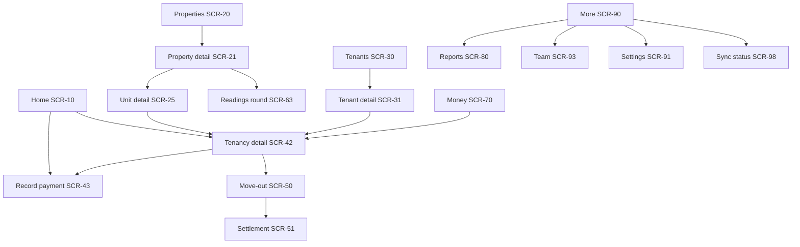

# 09 — UI/UX Specification

```text
Version:      0.1
Status:       Draft — awaiting owner review
Last Updated: 2026-09-18
Depends On:   02_FEATURE_SPECIFICATION.md, 03_USER_FLOWS.md, 07_API_SPECIFICATION.md, 08_SYNC_SPECIFICATION.md
Affected By:  10_FINANCIAL_RULES.md (displayed figures), 16_DECISION_LOG.md
```

## 1. Design principles

Built for landlords managing many properties, collecting rent in person, often with poor signal.

| # | Principle | Concrete rule |
|---|---|---|
| 1 | Fast data entry | Every money sheet opens **prefilled** (amount due, today, last method). The common case is one confirm tap. The core loop "see who hasn't paid → record payment" is ≤ 3 taps from app open. |
| 2 | Minimal navigation | Nothing is more than 2 levels below a tab. Actions appear where the data is (row buttons), not in menus. |
| 3 | Clear money | One number per question ("₹15,000 overdue"), never raw ledger math on the main screens. Advance is shown as "Advance ₹5,000", never "−₹5,000". |
| 4 | Status is text + colour | Chips always carry a word (PAID, PARTLY PAID, OVERDUE). Red is reserved for overdue and destructive actions only. |
| 5 | Easy search and filter | Global search in the top bar; a persistent property filter on Home, Money and Reports. |
| 6 | History is always one tap away | Tenant → all tenancies; unit → all tenancies; tenancy → full ledger with running balance. |
| 7 | Honest sync | Pending and failed items are always marked; nothing pretends to be saved on the server when it isn't. |
| 8 | Calm, not gamified | No streaks, confetti or scarcity tricks (this is a money tool). One subtle "paid" check animation (~400 ms) with a light haptic. |
| 9 | Progressive disclosure | Forms show required fields first and "More details" for the rest. |
| 10 | Recognition over recall | Pickers show unit + tenant + amount; previous meter reading shown next to the input. |

Ideas 4, 8, 9 and 10 and the colour tokens below were carried over from the earlier `rent_app/` notes, as ideas only.

## 2. Information architecture

### 2.1 Android

- **Top app bar (all tab screens):** workspace name (tap → switcher SCR-05), property filter chip ("All properties ▾"), search icon (SCR-86), sync indicator (SCR-98), notifications bell (SCR-85).
- **Bottom navigation (5 tabs):** Home · Properties · Tenants · Money · More.
- **"+" button (Home and Money):** Record payment (primary) · Add charge · Record reading · Add expense · New tenancy.



Reading the diagram: every path to a tenant's money ends at **Tenancy detail**, the one place where money is shown in full.

### 2.2 Website

- **Left sidebar:** Dashboard · Properties · Tenants · Tenancies · Money (Payments, Charges, Expenses) · Meters & readings · Documents · Reports · Team · Settings · Audit log.
- **Top bar:** workspace switcher, property filter, search, "+ New" menu, notifications, profile.
- Layout: list + detail pages; tables with sortable columns, filters and CSV export. Responsive down to 360 px, where the sidebar collapses to a menu. This matters because iPhone users use the website on their phones (D-007).

### 2.3 Role-based visibility
UI hides actions the role cannot perform (01 §12), and the server still enforces. A Viewer sees no "+" button, no row actions and no edit icons, and gets a read-only banner on forms.

## 3. Design system

### 3.1 Colour tokens

| Token | Light | Dark | Use |
|---|---|---|---|
| primary | #1B6B4A | #7BC8A1 | Primary buttons, active tab, links |
| on-primary | #FFFFFF | #00341F | Text on primary |
| primary-soft | #E3F2EA | #143D2B | PAID chip background, selected rows |
| status-paid | #1B6B4A | #7BC8A1 | PAID text/icon |
| status-due | #B3541E | #E5A06C | PARTLY PAID / due soon (amber, AA ≥ 4.5:1 on surface) |
| status-overdue | #B3261E | #F2B8B5 | OVERDUE, destructive only |
| surface | #FFFFFF | #1C1B1F | Cards, sheets |
| background | #F7F8F7 | #141414 | Screen background |
| text-primary | #1C1B1F | #E6E1E5 | |
| text-secondary | #49454F | #CAC4D0 | Captions |
| divider | #E4E6E4 | #33322F | |

Contrast of text tokens on surface ≥ 4.5:1 (checked for the light theme: primary 6.5:1, due 5.0:1, overdue 6.5:1). Theme follows the system (light/dark).

### 3.2 Typography
Android: Material 3 type scale with the system font. Web: system font stack. Money always uses **tabular numerals** (`font-feature-settings: "tnum"`) so columns align.

| Style | Size / weight | Use |
|---|---|---|
| display | 28 / bold | Big totals on dashboard |
| title | 20 / medium | Screen titles |
| body | 16 / regular | Rows, forms |
| label | 14 / medium | Buttons, chips |
| caption | 13 / regular | Dates, secondary lines |

### 3.3 Spacing and shape
8 dp grid (4 dp for tight); screen padding 16 dp; row height ≥ 56 dp; touch targets ≥ 48 dp; card radius 12 dp; inputs 8 dp; chips and buttons fully rounded.

### 3.4 Components

| Component | Specification |
|---|---|
| Money text | Formatted with the viewer's locale and the record's currency (e.g. ₹1,50,000 in en-IN; ₹150,000.00 in en-US). Zero shown as "₹0". Advance as "Advance ₹x". |
| Status chip | PAID (paid colours) · PARTLY PAID "₹5,000 left" (due) · UNPAID (neutral outline) · OVERDUE "12 days" (overdue) · ADVANCE (neutral outline) · VOID (grey, strikethrough row) |
| Sync markers | Clock icon = pending; warning icon = failed (tappable) |
| Tenancy row | Line 1: unit label · primary tenant; line 2 (caption): property · due date; trailing: amount + chip + "Record" button (Manager+). **Identical everywhere** (Home, Property, Tenant, Search). |
| Amount input | Numeric keypad, currency prefix, grouping as you type, max 12 digits, no negative |
| Date input | Native date picker; shortcuts "Today", "Yesterday" |
| Method chips | Cash · UPI · Bank · Cheque · Card · Wallet · Other (order: last used first) |
| Bottom sheet form | Title with context ("Room 101 · Rahul"), fields, one primary button whose label states the result ("Record ₹15,000") |
| Wizard | Stepper with titles, back/next, draft kept, review step before commit |
| Confirmation dialog | Only for destructive or final actions: void, delete, archive, cancel tenancy, finalize/reopen settlement, discard sync changes |
| Snackbar | Result + optional action ("Share receipt", "Undo" for 5 s when the op is still pending) |
| Empty state | Icon, one sentence, one primary action |
| Banner | Offline/stale data, read-only role, lease expired, sync issues |
| Skeleton | Web lists and dashboard while loading (Android reads locally, so no skeletons except the initial sync screen) |
| Photo grid | 3 columns, 4 dp gaps, pending-upload badge |

### 3.5 Copy and voice
Plain, calm and specific. Say what happened and what to do: "Room 101 already has a tenancy from 25 Sep. Change the unit or dates." Avoid jargon ("ledger" appears only as a tab name). Use no exclamation marks except the first-tenancy success message.

### 3.6 Accessibility
TalkBack/screen-reader labels on all icons and chips ("Status: overdue, 12 days"). Focus order follows visual order. Dynamic type up to 200% without clipping key numbers. Web meets WCAG 2.1 AA with keyboard navigation for all actions and visible focus. Colour is never the only signal.

### 3.7 Localization and formats
All strings externalized (Android `strings.xml`, web `messages/en.json`). Numbers, dates and currency use platform APIs (`NumberFormat`/`DateTimeFormatter`, `Intl`). Phone input uses a country picker defaulting to the workspace country, stored as E.164. Measurement units are chosen per meter/unit.

## 4. Screen specifications

Platform: **A** Android, **W** website, **A+W** both (same content, layout adapted). "Manager+" = Owner, Admin, Manager. States use the patterns in §3.4 unless stated.

### Authentication and workspace

**SCR-01 Sign in (A+W)**
- Purpose: start a session. Layout: logo, one line of value ("All your rent records in one place"), "Continue with Google", email field + "Send code", terms/privacy links.
- Validation: email format. States: sending (button spinner); error ("Couldn't send the code"); offline ("You need internet to sign in").
- Navigation: → SCR-02 (email) or → SCR-04/SCR-03/SCR-10.

**SCR-02 Verify code (A+W)**
- 6-digit code input (paste supported; submits automatically when 6 digits are entered), "Resend in 60 s", "Use a different email".
- Errors: wrong/expired code, too many attempts (wait message).

**SCR-03 Create workspace (A+W)**
- Fields: name*, country* (search list), default currency* (prefilled from country), time zone* (prefilled from device). Button "Create workspace". Navigation → SCR-10 with onboarding checklist.

**SCR-04 Accept invite (A+W)**
- Shows workspace name, inviter, role, access scope. Buttons "Join" / "Not now". Errors: expired, email mismatch (explains which email to use).

**SCR-05 Workspace switcher (A+W)**
- List of workspaces with role, unsynced-change count per workspace (A), "Create workspace". Tap → switch (A: opens that workspace's local data; initial sync if first time).

**SCR-06 Onboarding checklist (A+W, Home empty state)**
- Three steps with status: Add a property → Add units → Add a tenancy (new or existing). Each step button opens its flow. Hidden once one tenancy exists. Secondary link: "Invite a co-owner or manager".

### Home

**SCR-10 Home / Dashboard (A+W)** — F-DASH-1, REP-001
- **Layout (top → bottom):**
  1. Month selector (‹ Sep 2026 ›; tap label = current month); currency chip if > 1 currency.
  2. Summary card: "Collected ₹2,10,000 of ₹2,55,000" + progress bar (collected ÷ billed-due-this-month), then Outstanding ₹x (Overdue ₹y in red), Deposits held, Expenses, Net cash. Web shows these as a row of stat tiles.
  3. **Needs attention:** tenancies with overdue amounts, oldest first (tenancy rows with "Record" and "Remind").
  4. **Due in the next 7 days.**
  5. **Paid this month (N)** collapsed.
  6. **Coming up:** move-outs ≤ 30 days, leases ending ≤ 30 days, deposits not fully collected.
- Actions: record payment, remind, open tenancy, "+" quick actions.
- Loading: A instant from local data; W skeleton tiles.
- Empty: SCR-06. Month with no tenancies: "No rent was due in this month."
- Error: W banner with retry; A offline banner "Showing data from Tue 10:42".
- Permissions: all roles; actions per role.

### Properties and units

**SCR-20 Property list (A+W)** — F-PROP-4
- Rows: name, city, "12/14 occupied", outstanding (per currency), archived chip. Search box, filters (type, archived), sort (name, outstanding, occupancy). "+" (Manager+ with all-properties access).
- Empty: "No properties yet. Add your first building or house."

**SCR-21 Property detail (A+W)** — F-PROP-1…4, F-UNIT-2
- Header: name, address, currency, owners with shares.
- Tabs/sections: **Units** (grid on web, list on Android; each unit shows status chip Vacant/Occupied/On notice/Upcoming, tenant, balance), **This month** (billed, collected, outstanding, expenses, net), **Meters** (list + "Readings round"), **Expenses**, **Documents**.
- Actions: Add units, Edit, Owners, Payment details override, Archive/Delete (overflow).
- Empty units: "No units yet. Add one or add many at once."

**SCR-22 Property form (A+W)**
- Fields: name*, type*, address lines, city, region, postal code, country*, currency* (locked with explanation once tenancies exist), notes, photo.
- Validation: name 1–100 unique; codes. Success: → SCR-21 with "Add units" prompt.

**SCR-23 Owners and shares (A+W)**
- List of owners with share % inputs; "Add owner" (pick or create); "Split equally"; live total ("Total 100.00%" green / "90.00% — must be 100%" red). Save disabled until valid. Link "Invite this owner as a viewer".

**SCR-24 Add units (A+W)** — F-UNIT-1
- Toggle One / Many. Many: count, pattern ("Room {n}"), start, step, pad digits, type, floor/block, default rent, default deposit → live preview list (collisions marked red). Button "Create 14 units".

**SCR-25 Unit detail (A+W)**
- Header: label, type, floor, status chip, default rent.
- Sections: current tenancy card (tenant, rent, balance, "Open"), upcoming tenancy, meters with last reading, tenancy history (dates, tenant, closing status), documents.
- Actions: Start tenancy / Add existing tenancy (when vacant or on notice), Record reading, Edit, Archive/Delete.

**SCR-26 Unit form (A+W)**
- Fields per UNIT-002. Validation: label unique in property.

### Tenants

**SCR-30 Tenant list (A+W)** — F-TEN-2
- Segments: Current / Former / All. Rows: name, unit(s), balance, chips (Overdue / Archived). Search (name, phone, email, unit). Sort: name, balance.
- Empty: "No tenants yet. Tenants are added when you start a tenancy."

**SCR-31 Tenant detail (A+W)**
- Header: name, kind, contact buttons (Call, WhatsApp, SMS, Email).
- Sections: Tenancies (each with unit, dates, status, balance → SCR-42), Contact & emergency, ID (type + last 4), Documents (sensitive hidden for Viewer: "2 restricted documents"), Notes.
- Actions: Edit, Start tenancy for this tenant, Archive/Delete.

**SCR-32 Tenant form (A+W)**
- Always visible: kind, full name*, phone. "More details": alternate phone, email, address, emergency contact, ID type + last 4 (hint: "Don't enter full ID numbers"), notes, photo.
- Duplicate warning dialog on save (TENANT-005).

### Tenancies and money

**SCR-40 New tenancy wizard (A+W)** — F-TNCY-1, FL-05
Steps and fields:
1. **Unit & people:** unit* (search; shows status), primary tenant* (pick/create inline), co-tenants/occupants.
2. **Terms:** move-in date*, lease end, rent* (prefilled from unit default), rent period start ("1st of month" / "Same as move-in day"), due after (grace days, default 4, with example "Sep rent due by 5 Sep"), notice period, recurring charges (add rows).
3. **Deposit & move-in charges:** deposit agreed (prefilled), one-time charges (label, amount).
4. **Meters:** opening reading per meter (+ photo), or skip with reason.
5. **Inspection:** template items; set conditions and photos, or "Do later".
6. **Documents:** agreement, IDs.
7. **Review:** proposed charges table (editable amounts, remove line), totals "Due at move-in ₹x" and "Deposit ₹y"; terms summary. Button "Start tenancy".
- Validation per step (02). Overlap check at step 2 (local) and at commit (server).
- Success: SCR-42 + snackbar "Tenancy started. Record the deposit?" → SCR-43 prefilled.
- Draft: kept on Android until finished or discarded; the web warns on leaving.

**SCR-41 Existing tenancy wizard (A+W)** — F-TNCY-2, FL-07
Steps: Unit & people → Terms (original start date, current rent, cycle, grace, lease end) → **Billing start** (choice of this or next period start, explained) → **Opening balance** (radio: Tenant owes / Tenant paid ahead / Nothing; amount) → **Deposit** (agreed, already held) → Meters (last known reading + date) → Documents → Review.

**SCR-42 Tenancy detail (A+W)** — F-TNCY-7
- **Header card:** unit · property; tenants; labels (Upcoming / On notice / Lease expired); big line "₹15,000 due · Overdue 12 days" or "Advance ₹5,000" or "All paid"; next due date and amount; deposit "Held ₹30,000" (+ "Due ₹5,000" if any).
- **Primary actions (row of buttons):** Record payment · Remind · Add charge · More (credit, refund, apply deposit, change rent, give notice, move out, statement, cancel).
- **Tabs:** Ledger | Details | Utilities | Documents | Inspections | Activity.
  - **Ledger:** newest first; each line: date, description, amount (+ charge status chip / receipt no. for payments), running balance; voided lines struck through with reason; pending/failed markers; filter All/Charges/Payments; tap line → actions (Share receipt, Void, Correct, Edit note).
  - **Details:** terms, parties (add/remove/primary), rent history, recurring charges, schedule preview (next 12 periods).
  - **Utilities:** meters on the unit, readings with photos, "Record reading".
  - **Activity** (Owner/Admin; online only on Android): audit entries for this tenancy (who/what/when; reminders noted). Other roles see "Last reminder: 3 Oct by Priya" in the header card (from `summary.last_reminder_at`).
- Closed tenancy: read-only banner "Closed on 14 Mar 2027" (+ "Reopen settlement" for Owner/Admin).
- Empty ledger: "No entries yet."

**SCR-43 Record payment (sheet, A+W)** — F-PAY-1
- Header: "Room 101 · Rahul Verma", due now ₹15,000 (overdue ₹5,000).
- Fields: **Towards rent & charges** amount (prefilled with due now); **Towards deposit** (shown only if deposit due > 0, prefilled); date (today); method chips; reference (shown for non-cash); note; proof photo(s).
- Live allocation text: "Clears Aug (₹5,000) and Sep (₹10,000 of ₹15,000)"; if more than due: "₹3,000 will be kept as advance".
- Validation: ≥ one amount > 0; date window (BR-021); duplicate warning dialog.
- Primary button: "Record ₹15,000". Success: sheet closes → row updates (PAID chip animation) → snackbar "Recorded · Share receipt" (online) / "Receipt available after sync" (offline).
- Permissions: Manager+.

**SCR-44 Add charge (sheet, A+W)** — F-RENT-2
- Fields: category* (chips), description* (prefilled by category, e.g. "Electricity bill"), amount*, date* (today), due date* (date + grace), period (optional), bill photo. Button "Add ₹1,850 charge".

**SCR-45 Add credit (sheet, A+W)** — F-RENT-3
- Fields: type* (Discount, Waiver, Adjustment, Write-off), amount*, date*, reason* (required). Warning if it creates an advance.

**SCR-46 Refund / Apply deposit (sheet, A+W)** — F-PAY-4, F-DEP-3
- Mode tabs: "Refund advance", "Refund deposit", "Use deposit for dues". Shows the available amount; the amount is capped to it. Fields: amount, date, method/reference (refunds), reason (apply).

**SCR-47 Void / Correct (dialog, A+W)** — F-RENT-4, F-PAY-2
- Shows the entry. Reason chips + text. Buttons: "Void" (red) / "Void and re-enter" / Cancel. Warnings: generated rent ("won't be billed again automatically"), receipt ("Receipt R-000123 will show VOID").

**SCR-48 Change rent (sheet, A+W)** — F-TNCY-4
- Fields: new rent*, effective from* (dropdown of period start dates), reason. If backdated: list of proposed adjustments (editable). Prompt afterwards: "Increase deposit too?"

**SCR-49 Give notice (sheet, A+W)** — F-MOUT-1
- Fields: notice date* (today), planned move-out* (last day of occupancy), given by (Tenant/Landlord), note. Warning if shorter than the notice period. "Withdraw notice" when set.

**SCR-50 Move-out wizard (A+W)** — F-MOUT-2, FL-18
Steps: Date (actual move-out, default planned) → Final readings (previous value shown, photo) → Inspection (move-in condition beside each item; mark changes; photos; keys returned) → go to Settlement (SCR-51).

**SCR-51 Settlement review (A+W)** — F-MOUT-3, FL-19
- Sections with editable lines:
  1. Rent to adjust: voided future periods; proration credit ("Mar: 12 of 31 days → credit ₹9,194").
  2. Final utilities (from readings).
  3. Deductions (add: category, amount, reason, photos).
  4. Summary: Outstanding before deposit · Deposit held · Deposit applied · **Refund to tenant ₹19,554** or **Tenant owes ₹x** (large, one line).
  5. Refund now? (toggle: method, date, reference).
- Buttons: "Save draft", "Finalize settlement" (confirmation dialog listing totals). SETTLEMENT_STALE → dialog "Balances changed" + refreshed numbers.
- After finalize: status + "Share settlement PDF".

**SCR-52 Receipt (A+W)**
- PDF preview; buttons Share (WhatsApp/email/share sheet), Download. VOID watermark for voided payments. Disabled state for pending payments.

**SCR-53 Statement (A+W)** — REP-005
- Date range (default whole tenancy), preview table (opening balance, entries, running balance, closing), deposit summary; Share PDF / CSV.

**SCR-54 Send reminder (sheet, A+W)** — F-PAY-6
- Recipient (primary tenant; co-tenants selectable), channel (WhatsApp, SMS, Email, Other apps), editable message from template (12 §5), "Attach payment QR" (share-sheet only). Button opens the chosen app; on return: "Reminder noted".

**SCR-55 Inspection editor (A+W)** — F-MIN-1
- Grouped by area; item rows with condition chips (Good/Fair/Damaged/Missing/N/A), note, camera button; add item/area; keys count; "Mark complete". Move-out mode shows the move-in condition and photo thumbnails beside each item.

### Utilities

**SCR-60 Meters (A+W)** — F-UTIL-1
- Per property: list grouped by unit (common meters under "Property"), each with type icon, label, rate, last reading + date. Actions: Add meter, Record reading, Readings round.

**SCR-61 Meter form (A+W)**
- Fields: attached to (unit/property)*, type*, label*, serial, unit of measure*, rate per unit*, fixed charge. Note: "Rate changes apply to new bills only."

**SCR-62 Record reading (sheet, A+W)** — F-UTIL-2
- Shows previous reading (value, date, photo thumbnail). Fields: date* (today), value*, photo, "Meter replaced?" toggle (old final + new start). Live calculation: "219.5 kWh × ₹9.50 = ₹2,085" with editable amount and due date; toggle "Add to Rahul's balance" (on when billable). Warning for unusually high consumption. Button "Save reading" / "Save & bill ₹2,085".

**SCR-63 Readings round (A+W)** — F-UTIL-3
- Table-like list: unit, tenant, previous (date), new value input, photo button, consumption, amount. Keyboard "Next" moves to the next row. Row states: valid / warning / error / skipped. Footer: "15 of 18 entered · ₹31,240". Review → Save. The draft is kept on Android.

### Money, expenses, documents

**SCR-70 Money (A+W)**
- Segments: Payments | Charges | Expenses. Filters: date range (default this month), property, method, category, account, include voided. Rows show date, tenant/unit or payee, amount, method, receipt no.; totals per currency at the top. W: export CSV. "+" for payment/charge/expense.

**SCR-72 Expense form (sheet, A+W)** — F-EXP-1
- Fields: property (or "Workspace-level"), unit, category*, amount*, date*, payee, method, reference, note, receipt photo. Edit mode adds "Void".

**SCR-75 Documents & viewer (A+W)** — F-DOC-2
- Grid/list by category for the parent entity; sensitive badge; pending-upload badge; tap → viewer (zoom, share for permitted roles). Restricted count for Viewers.

**SCR-76 Add document (sheet, A+W)** — F-DOC-1
- Source: Camera / Gallery / File (PDF). Category* (ID categories marked "sensitive"), title. Quota-exceeded error.

**SCR-77 Recently deleted (W)** — F-DOC-3
- Deleted documents with days left, "Restore".

### Reports, notifications, search

**SCR-80 Reports hub (A+W)**
- Cards: Rent roll, Outstanding & aging, Collections, Deposits, Expenses, Property income, Vacancy, Lease expiry, Tenant statement (pick tenancy), Full export (W, Owner/Admin).

**SCR-81 Report viewer (A+W)** — 13
- Filters bar (property, dates/as-of, grouping), table with totals per currency, sort by column, CSV export (A: online only, share sheet). Empty: "No data for these filters."

**SCR-82 Full data export (W)** — F-REP-3
- Explanation of contents, "Include archived" checkbox, "Download ZIP". Shows a progress indicator while streaming.

**SCR-85 Notifications (A+W)** — F-NOT-2
- List (newest first) with unread dot, tap → deep link, "Mark all read". Empty: "You're all caught up."

**SCR-86 Search (A+W)** — F-SRCH-1
- Search field with instant results grouped: Tenants, Units, Properties, Receipts. Recent searches not stored (privacy). Empty: "No matches for 'xyz'."

### Settings and team

**SCR-90 More / Settings hub (A+W)**
- Rows: Reports, Team, Workspace settings, Payment details, Notification preferences, Profile & security, Sync status (A), Audit log (W), Help & feedback, Privacy & terms, About (version).

**SCR-91 Workspace settings (A+W, Owner/Admin)** — F-SET-1
- Fields per SET-001: name, country, default currency, time zone, rounding toggle ("Round calculated amounts to whole ₹"), receipt prefix and footer, landlord name/address/phone/email for documents, default digest time. Danger zone: Transfer ownership (Owner), Delete workspace (Owner).

**SCR-92 Payment instructions (A+W, Owner/Admin)** — F-PAY-5
- Fields: bank details (text), payment handle/UPI ID, payment link, QR image; preview of the reminder message; per-property override list.

**SCR-93 Team (A+W)** — F-TEAM-2/3
- Members list: name/email, role, access ("All properties" / "3 properties"), status (Active/Invited). Actions: Invite, Edit, Revoke, Resend invite. Viewer/Manager see the list read-only.

**SCR-94 Invite / edit member (sheet, A+W)**
- Fields: email* (invite only), role* (with one-line descriptions), access: all / selected properties (multi-select). Online only.

**SCR-95 Notification preferences (A+W)** — F-NOT-2
- Daily digest on/off + time; toggles per event (12 §3); push permission status (A) with "Turn on".

**SCR-96 Profile & security (A+W)**
- Name, phone, email (read-only), app lock toggle (A), "Sign out", "Sign out of all devices".

**SCR-97 Delete account / workspace (A+W)** — F-ACC-4, FL-25
- Explains consequences and the 30-day grace, lists blockers with links, offers export, requires typing DELETE (or the workspace name).

**SCR-98 Sync status & issues (A)** — 08 §18
- Status line, "Sync now", last pull/push times, pending changes by type, **Issues** list (plain message + Edit/Retry/Discard/Copy), files uploading (progress), diagnostics.

**SCR-99 Audit log (W, Owner/Admin)** — F-TEAM-4
- Table: time, member, source, action, entity (link), changes (expand to before → after). Filters: entity, member, action, date range.

### Version 1 screens (outline)

| Screen | Content |
|---|---|
| Tenant home (A+W) | Tenancies across landlords; due now; pay-by details (QR, UPI, bank); latest receipts; notices |
| Tenant ledger & receipts | Read-only ledger, statement download |
| Payment claim (sheet) | Amount, date, method, reference, proof → "Sent to landlord" |
| Notices (landlord) | Compose (title, text, attachments, audience), history with read counts |
| Notices (tenant) | List, detail, mark read |
| Chat list / thread | Per tenancy; text and a few compressed photos, no documents (D-057); "Send payment details" card; unread badges |
| Claims inbox (landlord) | Accept (prefilled payment) / Reject (reason) |
| Billing (W, Owner) | Plan, billable properties, invoices, payment method (provider-hosted) |

## 5. State patterns summary

| State | Android | Website |
|---|---|---|
| Loading | Local data immediately; initial sync screen only once | Skeletons; buttons with spinners |
| Empty | Icon + one sentence + one action | Same |
| Error | Inline field errors; sync issues for server rejections; snackbar for transient problems | Inline field errors; error banner with retry; problem+json `detail` shown |
| Success | Snackbar with follow-up action; row updates in place | Toast + page data refreshed |
| Offline | Banner when data > 24 h old; pending markers | Full-page "You're offline. Changes can't be saved." |
| Permission denied | Actions hidden; read-only banner | Same |
