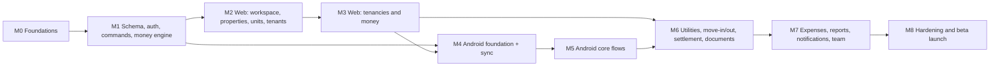

# 15 — Development Roadmap

```text
Version:      0.1
Status:       Draft — awaiting owner review
Last Updated: 2026-09-18
Depends On:   01–14
Affected By:  16_DECISION_LOG.md (D-050 build order), beta feedback
```

## 1. Order and why it differs from the example sequence

The master prompt's example put **Synchronization at milestone 7** and the **web dashboard at 8**. That order was not used, because the architecture makes it risky:

| Change | Reason |
|---|---|
| Money engine and database constraints come first (M1) | Every feature depends on them. The test vectors lock behaviour before any UI exists. |
| **Web before Android** (M2–M3) | The website is online-only, so the domain and API can be validated without sync complexity. At the end of M3 friendly landlords can already use the product on a phone browser (early feedback). This also matches the owner's note "web page is easier". |
| **Sync is built into the Android app from its first screen** (M4), not added later | Retrofitting offline sync into a finished online app forces rewrites of every repository and screen. |
| Documents (photos) move to M6 | Inspections, readings and settlements are where photos matter. |
| Permissions are enforced from M1; the team UI comes in M7 | Authorization is part of the command framework, so invites are only UI + email. |



Effort figures are rough estimates for **one full-time developer**, excluding the owner's decision time. The MVP totals ~24 weeks; plan ~28 weeks with a 15–20% buffer.

## 2. Definition of Done (every feature)

- Requirement IDs listed in the PR; traceability (17) updated if new.
- Server validation and authorization in place; audit events written.
- Android: works offline, marked pending, syncs, and handles rejection (sync issue).
- Tests from 14 for the feature pass; financial changes add or modify vectors.
- Strings externalized; TalkBack labels; empty, error and loading states per 09.
- Docs updated if behaviour differs from them (decision logged).

## 3. MVP milestones

### M0 — Foundations and decisions (1 week)
- **Objectives:** close the critical decisions and get empty apps deploying.
- **Tasks:** confirm D-012, D-014, D-020, D-021, D-022; decide the hosting region (D-030); monorepo (`android/`, `web/`, `spec/`, `docs/`); Supabase staging + production projects; Vercel projects; domain; Sentry; GitHub Actions skeleton; Android skeleton (Compose, Hilt, Room, WorkManager, flavors); web skeleton (Next.js, Tailwind, shadcn/ui, next-intl); design tokens (09 §3); first vectors FIN-TEST-001…010.
- **Dependencies:** owner decisions.
- **Acceptance:** CI green on both apps; staging URL live; decision log updated.
- **Risks:** decisions drag on → defaults in 00 are used after 1 week.

### M1 — Schema, auth, command framework, money engine (2.5 weeks)
- **Objectives:** a correct, tested core that every client uses.
- **Tasks:** migrations for all MVP tables (05) incl. triggers, exclusion constraint, RLS deny-all and roles; JWT verification (JWKS); `can()` authorization with the 01 §12 matrix; command framework (transaction, counter lock, version stamping, audit, op idempotency via `sync_ops`, problem+json errors); TypeScript domain (proration, utility, schedule, revision adjustments, settlement); FIFO SQL view and balance queries; all 24 vectors; seed generator; sync simulator skeleton.
- **Dependencies:** M0.
- **Acceptance:** DB-TEST-001…006 pass; FIN-TEST-001…024 pass (TS + SQL); SYNC-TEST-008 (versioning under concurrency) passes; PERM-TEST framework runs.
- **Risks:** version/locking subtleties → tested first (SYNC-TEST-008).

### M2 — Web: workspace, properties, units, owners, tenants (2 weeks)
- **Objectives:** a landlord can set up a portfolio on the website.
- **Tasks:** SCR-01…06, 20…26, 30…32, 91, 92, 96; endpoints 07 §3.1–3.5; payment instructions; search (web).
- **Dependencies:** M1.
- **Acceptance:** FL-01…04 work on web; PROP-TEST-001…003, UNIT-TEST-001, TENANT-TEST-001, ACC-TEST-001/002 pass.
- **Risks:** UI polish consuming time → use shadcn/ui components unchanged.

### M3 — Web: tenancies and money (3 weeks)
- **Objectives:** the full money loop on the website.
- **Tasks:** new and existing tenancy wizards (SCR-40/41) with preview; ledger (charges, payments, credits, refunds, deposit application, voids); receipt numbering and PDF; statement PDF/CSV; rent generation job + recurring charges; rent revisions with adjustments; notice; reminder share links; tenancy detail (SCR-42); Home dashboard v1.
- **Dependencies:** M2.
- **Acceptance:** FL-05, FL-07…FL-13, FL-17, FL-28 on web; RENT-TEST, PAY-TEST, TNCY-TEST-001…007, DEP-TEST-001 pass; REP-TEST-001 on seed. **Friendly web beta** with 2–3 landlords starts.
- **Risks:** proration/revision edge cases → vectors first.

### M4 — Android foundation and sync engine (4 weeks)
- **Objectives:** a read-and-write offline-capable Android shell on a proven sync protocol.
- **Tasks:** server `sync/pull`, `sync/push`, `sync/entities`; Android sign-in (Credential Manager + Supabase, email code); workspace switcher; Room mirror + local tables (08 §4); initial and incremental pull; outbox, push worker, rebase, dependency blocking, undo-before-send; sync status and issues screen (SCR-98); Kotlin domain engine + vectors; read-only Home, Properties, Tenants, Tenancy detail.
- **Dependencies:** M1 (commands), M3 (money commands exist).
- **Acceptance:** SYNC-TEST-001…018 (simulator) and their Android JVM equivalents pass; FIN vectors pass in Kotlin; PERF-TEST-001 initial run.
- **Risks:** highest technical risk. Keep scope strictly to sync and read screens; no new features in this milestone.

### M5 — Android core flows (3 weeks)
- **Objectives:** landlords can run the monthly cycle on the phone, offline.
- **Tasks:** record payment sheet (SCR-43), charges, credits, refunds, void/correct, reminders (WhatsApp/SMS intents), property/unit/tenant CRUD, new and existing tenancy wizards, rent revision, notice, search, persistent property filter, receipts and statements (online), app lock.
- **Dependencies:** M4.
- **Acceptance:** UI-TEST-001, -002, -005 pass; OFF-TEST-001 (payments, charges, tenancy parts) passes; web and Android show identical balances on the seed.
- **Risks:** wizard complexity on small screens → reuse web step structure.

### M6 — Utilities, move-in/out, settlement, documents (3 weeks)
- **Objectives:** complete tenancy lifecycle with evidence.
- **Tasks:** documents (upload URL flow, offline queue, compression, sensitive handling, quota, soft delete/restore); meters, readings (replacement), utility charges, readings round; inspections (move-in and move-out comparison); move-out; settlement preview/finalize/reopen + PDF; on web and Android.
- **Dependencies:** M3 (ledger), M5 (Android flows).
- **Acceptance:** UTIL-TEST-001…005, SETTLE-TEST-001…004, DOC-TEST-001…004, TNCY-TEST-008, UI-TEST-003/004, OFF-TEST-003 pass.
- **Risks:** photo upload reliability on bad networks → resumable per-file retries, clear status.

### M7 — Expenses, reports, notifications, team (3 weeks)
- **Objectives:** landlord insight, alerts and sharing.
- **Tasks:** expenses; reports REP-002…REP-010 with CSV and full export; final dashboard; FCM digest, in-app notifications, preferences; transactional emails; team invites, roles, scope, revocation, ownership transfer, audit log viewer (web); Android access-change and revocation handling.
- **Dependencies:** M6.
- **Acceptance:** REP-TEST-001…008, NOTIF-TEST-001…004, TEAM-TEST-001…004, PERM-TEST-001…006, SYNC-TEST-010/011 pass.
- **Risks:** report performance → PERF-TEST-002 on the `large` seed; add caches only if needed.

### M8 — Hardening and beta launch (2.5 weeks)
- **Objectives:** safe to put real landlords' data in.
- **Tasks:** SEC-TEST-001…010; external security review (recommended); account and workspace deletion + purge jobs; off-site backups + first restore drill; performance tuning; accessibility pass; privacy policy, terms, DPA **[LEGAL CHECK]**; Play Store listing, data safety form, closed testing track; monitoring and alerts (06 §11); beta onboarding kit (short guide, WhatsApp support group).
- **Dependencies:** M7.
- **Acceptance:** all CI gates green; release checklist (14 §6) complete; PERF-TEST-001…003 pass; 5–10 beta landlords onboarded.
- **Risks:** Play review delays → submit to closed testing early in M8.

**MVP total ≈ 24 weeks** (M0 1 · M1 2.5 · M2 2 · M3 3 · M4 4 · M5 3 · M6 3 · M7 3 · M8 2.5).

## 4. Version 1 milestones (after ~6 weeks of beta)

Order is re-evaluated from beta feedback; this is the default.

| Milestone | Scope | Effort | Key acceptance |
|---|---|---|---|
| V1-M1 Tenant accounts & portal | Phone OTP (SMS provider), tenant invites and links, tenant views on web and Android (role-based app), shared documents, payment claims | 4 wk | Tenant sees only own tenancies across workspaces; claims create payments on acceptance |
| V1-M2 Notice board | Compose, audiences, attachments, push, read receipts | 1.5 wk | Audience resolution and read counts correct |
| V1-M3 Chat | One conversation per tenancy, Supabase Realtime + FCM, images/PDF, payment-details card, report message, retention (D-055) | 4 wk | Delivery ≤ 3 s online; offline queued; no cross-tenancy leakage |
| V1-M4 Billing | Merchant-of-record provider (D-054), per-property quantity (D-010), grace and read-only lock, beta discount | 2.5 wk | Webhook-driven status; no data loss on non-payment; policy check D-046 done |
| V1-M5 Operations pack | Staff role, automatic late fees, owner statements, shared meters, CSV import, recurring expenses, unit transfer, move-in PDF, utility report, weekly email, push-triggered sync, tenant anonymization, inspection templates, property tags | ~5 wk (pick by demand) | Each item's tests from 14 extended |

**V1 total ≈ 17 weeks.**

## 5. Future (not scheduled)

iOS app via Kotlin Multiplatform · online rent collection · bank/UPI statement import and reconciliation · automated WhatsApp/SMS · voice notes · meter-reading OCR · tariff slabs · accounting/tax exports · more languages · e-signature and agreement templates · maintenance tickets and vendors · owner portal with payouts · custom roles · public API · workspace transfer · non-monthly rent cycles · jurisdiction-specific deposit rules.

## 6. Roadmap risks

| Risk | Mitigation |
|---|---|
| Solo capacity and scope creep | Strict milestone scope; anything new goes to V1/Future via the decision log |
| Sync milestone overruns | Timebox M4; the web beta already provides value; cut Android features, never sync correctness |
| Legal review delays public launch | Start the lawyer engagement in M6; the beta can run with a basic policy while scope is small |
| Beta users find data entry heavy | Prioritise V1 CSV import and staff role if feedback says so |
| Cost growth | Monitor usage monthly; the plan in 06 §15 applies only when measured |
